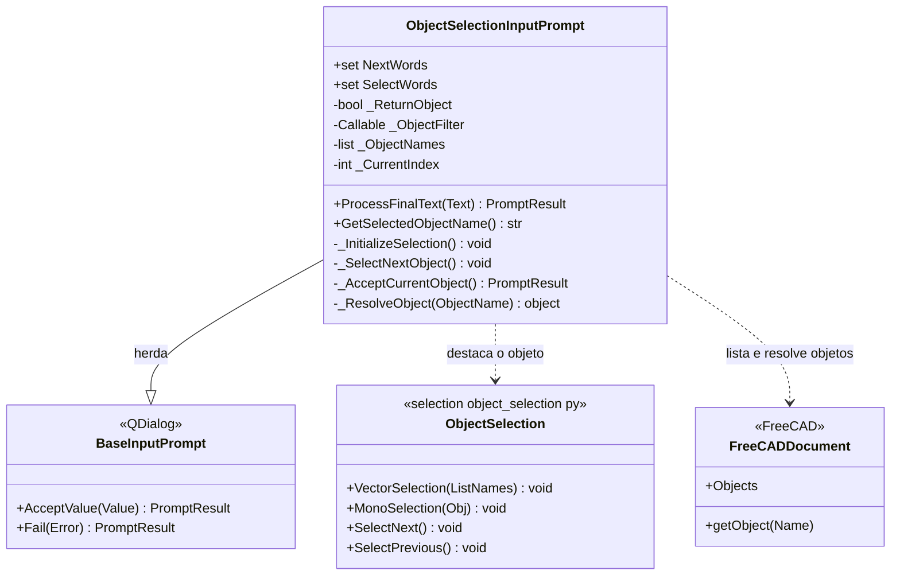

# ObjectSelectionInputPrompt

> **Arquivo:** `Dav/scr/ComponentesDAV/IntegracionGUI/GUIFreeCad/InputPrompts/ObjectSelectionInputPrompt.py`

Escolhe **um objeto do documento ativo** percorrendo-os por voz: *siguiente*
destaca o próximo (na vista 3D e na árvore) e *okey* ou *seleccionar* o
confirma. É o prompt que o `ParameterCollector` cria para os parâmetros do tipo
objeto.

## Como funciona

1. Ao ser criado, pega os objetos do documento ativo. Se um `ObjectFilter` foi passado, só
   permanecem os que devolvem `True`.
2. Sem documento, ou sem objetos que atendam ao filtro, faz `Fail` com uma mensagem e não oferece nada.
3. `siguiente` (ou *otro*, *avanzar*, *next*, *seguinte*…) passa ao próximo, voltando
   ao início ao chegar ao fim.
4. `okey` ou `seleccionar` aceita o objeto destacado.

| `ReturnObject` | Valor aceito |
| --- | --- |
| `False` (padrão) | O **nome** do objeto (texto) |
| `True` | O objeto do FreeCAD; se não puder ser resolvido, recorre ao nome |

## Notas de design

- **O filtro é o que o torna reutilizável.** `askObject` em `Workbench/_prompts.py`
  o usa com filtros como `isProfile` ou `isSolid` para oferecer só esboços ou só peças.
- **Importa `ObjectSelection` com vários caminhos de reserva**, porque `scr/selection/`
  pode não estar em `sys.path` quando roda dentro do FreeCAD.
