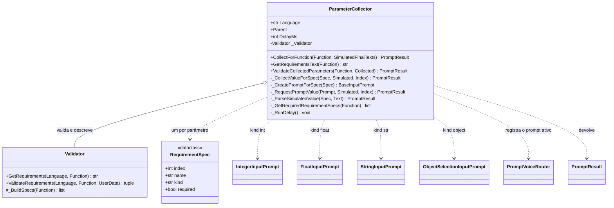

# ParameterCollector

> **Arquivo:** `Dav/scr/ComponentesDAV/IntegracionGUI/GUIFreeCad/InputPrompts/ParameterCollector.py`

Reúne **todos os parâmetros de que uma função** do dicionário precisa. Examina a
assinatura da função (com ajuda do [`Validator`](Validator.md)), abre um diálogo de
voz para cada parâmetro obrigatório conforme o seu tipo e, ao final, valida o conjunto.
Devolve um `PromptResult` cujo valor é o dicionário de argumentos pronto para
chamar a função.

## Qual prompt cada tipo abre

| `kind` | Prompt | Valor |
| --- | --- | --- |
| `int` | [`IntegerInputPrompt`](NumericInputPrompt.md) | `int` |
| `float` | [`FloatInputPrompt`](NumericInputPrompt.md) | `float` |
| `str` | `StringInputPrompt` | texto sem a palavra de confirmar |
| `object` (e todo o resto) | [`ObjectSelectionInputPrompt`](ObjectSelectionInputPrompt.md) | nome do objeto |

## Responsabilidades

| Método | O que faz |
| --- | --- |
| `CollectForFunction(Function, Simulated)` | Percorre os parâmetros **obrigatórios**, pede-os um a um e valida o conjunto. Sem parâmetros obrigatórios devolve `Ok({})` |
| `_RequestPromptValue` | Registra o prompt no [`PromptVoiceRouter`](PromptVoiceRouter.md), exibe-o como modal e **sempre** o libera ao terminar |
| `GetRequirementsText(Function)` | Texto localizado dos requisitos (montado pelo `Validator`) |
| `ValidateCollectedParameters` | Converte e valida os valores com `Validator.ValidateRequirements` |
| `_RunDelay()` | Pausa `DelayMs` com um `QEventLoop` entre um prompt e o seguinte, sem congelar a interface |

## Notas de design

- **Se qualquer parâmetro for cancelado, tudo é cancelado:** o resultado cancelado sobe como está e a função não é executada.
- **Modo simulado.** `SimulatedFinalTexts` substitui a voz por uma lista de frases
  (uma por parâmetro, cada uma terminada em «okey»). Permite testar a coleta sem
  microfone nem janelas.
- **O idioma é lido a cada vez.** `Language` consulta `ResolveLanguage()` ao vivo: o
  coletor é criado uma única vez ao iniciar a voz e, se guardasse o idioma daquele
  momento, os títulos ficariam no idioma anterior após trocá-lo em Preferências.
- **Reserva sem `Validator`:** `_BuildFallbackSpecs` monta as especificações a partir das
  anotações de tipo da função (`int`, `float`, `str`; qualquer outra coisa é `object`).
- Fluxo completo: [`FluxoComandoComParametros`](FluxoComandoComParametros.md).
