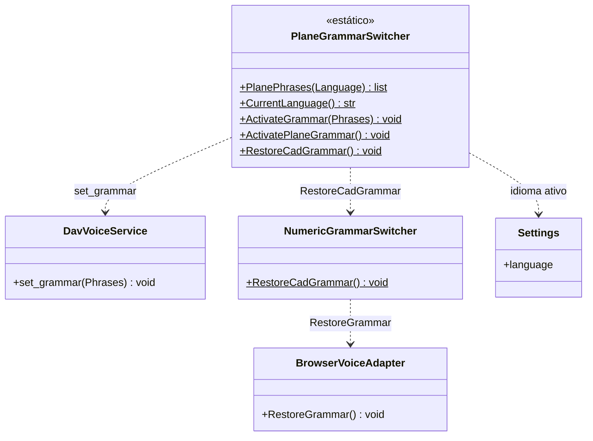

# PlaneGrammarSwitcher

> **Arquivo:** `Dav/scr/ComponentesDAV/IntegracionGUI/GUIFreeCad/InputPrompts/PlaneGrammarSwitcher.py`

Restringe a gramática do Vosk a **poucas palavras que um diálogo entende**. Com o
vocabulário aberto, o Vosk confunde as palavras de navegação com outras parecidas;
com uma gramática pequena o reconhecimento melhora muito. Embora se chame
«Plane», hoje é usado por todos os prompts com vocabulário próprio.



## Responsabilidades

| Método | O que faz |
| --- | --- |
| `PlanePhrases(Language)` | Frases mínimas: arriba/abajo, confirmação (okey, enviar, listo…) e cancelamento |
| `CurrentLanguage()` | Idioma configurado (`es` se não puder ser lido) |
| `ActivateGrammar(Phrases)` | Restringe o Vosk a essas frases. Se falhar, o reconhecimento continua com vocabulário aberto |
| `RestoreCadGrammar()` | Devolve a gramática do contexto atual do `Browser` |

## Padrão de uso

```python
PlaneGrammarSwitcher.ActivateGrammar(prompt.GrammarPhrases(idioma))
PromptVoiceRouter.SetActivePrompt(prompt)
try:
    resultado = prompt.RequestValue()
finally:
    PromptVoiceRouter.ClearActivePrompt(prompt)
    PlaneGrammarSwitcher.RestoreCadGrammar()
```

## Notas de design

- **As palavras também devem existir em `NavCommands/TraduceTo*.py` ou em
  `SpokenNumberParser`**, para que o prompt as reconheça quando o texto final chega.
- **Nunca quebra o diálogo:** todos os métodos que falam com o Vosk estão dentro de
  `try` / `except`. Sem gramática restrita nota-se a diferença, mas o seletor continua funcionando.
- Como a gramática do `Browser` é restringida: [`encurtador-gramatica-vosk.md`](../encurtador-gramatica-vosk.md).
