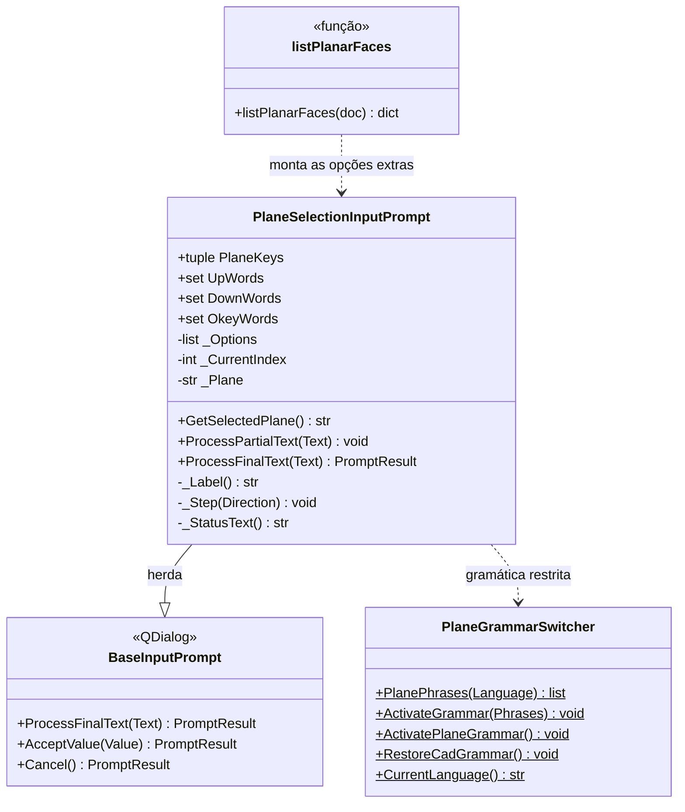

# PlaneSelectionInputPrompt

> **Arquivo:** `Dav/scr/ComponentesDAV/IntegracionGUI/GUIFreeCad/InputPrompts/PlaneSelectionInputPrompt.py`

Seletor de voz que substitui o diálogo nativo do FreeCAD para escolher onde
desenhar um esboço. Mostra os três planos base (`XY`, `XZ`, `YZ`) e, quando há
um sólido, **as faces** sobre as quais é possível desenhar. É usado por «nuevo croquis»
(PartDesign, Part e Sketcher) e por `grabar`.

Como isso aparece para o usuário: veja
[`manual-esboco-e-gravacao-voz.md`](../manual-esboco-e-gravacao-voz.md).

## Responsabilidades

| Método | O que faz |
| --- | --- |
| `__init__(..., ExtraOptions)` | Lista os três planos e, depois, as opções extras `(chave, rótulo)` (as faces) |
| `ProcessFinalText(Text)` | `arriba`/`abajo` percorrem a lista de forma circular; `okey` aceita; `cancelar` aborta |
| `GetSelectedPlane()` | Chave da opção destacada: `XY`, `XZ`, `YZ` ou a chave de uma face (`Face3`) |

## Notas de design

- **Os planos vêm sempre primeiro.** Com `ExtraOptions` vazio o comportamento
  é idêntico ao anterior; quem chama sem faces (por exemplo `askPlane()` do
  espelho) continua vendo apenas `XY`, `XZ` e `YZ`.
- **O prompt não sabe o que é uma face.** Só recebe `(chave, rótulo)`; quem
  chama guarda qual sólido e qual face há por trás de cada chave
  (`listPlanarFaces`, em `Sketcher/new_sketch/_faces.py`).
- **Mesmo texto de sempre para os planos** («Plano XY (1/3)…»); as faces
  mostram o seu rótulo («Cara superior»).
