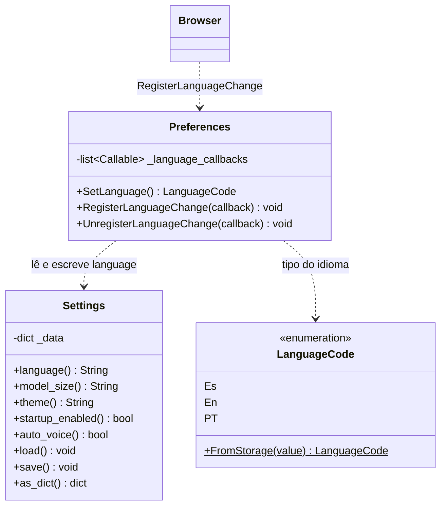

# Preferences e Settings

> **Arquivos:**
> `Dav/scr/ComponentesDAV/IntegracionGUI/GUIFreeCad/core/preferences.py`
> `Dav/scr/ComponentesDAV/IntegracionGUI/GUIFreeCad/core/settings.py`

Duas classes com papéis distintos que convém não confundir: `Settings` persiste a
configuração em disco; `Preferences` expõe o idioma ativo ao `Browser` e
avisa quando ele muda.



## O fluxo de uma troca de idioma

```mermaid
sequenceDiagram
    participant D as Diálogo Preferências
    participant P as Preferences
    participant S as Settings
    participant B as Browser
    participant V as DavVoiceService

    D->>P: SetLanguage = LanguageCode.Es
    P->>S: language = "es" ; save()
    P->>B: callback(anterior, novo)
    B->>B: ResetFromBase()
    Note over B: recarrega TraduceToEs.py<br/>de toda a árvore
    D->>V: reinicia o microfone
    Note over V: é preciso recarregar o modelo:<br/>é outro arquivo do Vosk
```

## Notas de design

- **`Preferences` é o único que deveria escrever o idioma.** É o ponto em que
  se dispara a recarga dos dicionários; escrever `settings.language` à mão
  a ignora.
- **O observer é uma lista, não um callback único** (`RegisterLanguageChange`),
  assim vários interessados podem se inscrever sem se sobrescrever.
- `Settings` salva em `config/settings.json`, que está no `.gitignore`: é
  configuração do usuário, não do repositório.
- Trocar o idioma **obriga a reiniciar a thread de voz**, porque o modelo Vosk
  é carregado uma única vez ao criar o recognizer e cada idioma é um modelo
  diferente.
