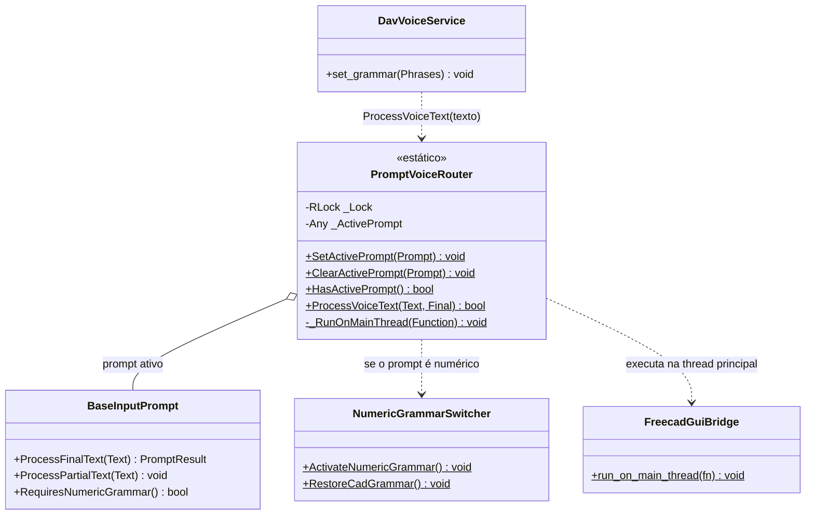

# PromptVoiceRouter

> **Arquivo:** `Dav/scr/ComponentesDAV/IntegracionGUI/GUIFreeCad/InputPrompts/PromptVoiceRouter.py`

Registro de **quem recebe o que é dito**. Enquanto há um diálogo de voz
aberto, tudo o que é reconhecido vai para esse diálogo e **não** para o `Browser`: assim «cinco»
dentro de um prompt numérico não é interpretado como um comando. É um registro
global com lock, seguro entre threads.

## Responsabilidades

| Método | O que faz |
| --- | --- |
| `SetActivePrompt(Prompt)` | Registra-o; se `RequiresNumericGrammar()` for `True`, troca a gramática para as palavras de números |
| `ClearActivePrompt(Prompt)` | Libera-o (somente se ainda for o ativo) e, se era numérico, restaura a gramática de CAD |
| `HasActivePrompt()` | `True` enquanto há um diálogo recebendo a voz |
| `ProcessVoiceText(Text, Final)` | Entrega a frase (final ou parcial) ao prompt. Devolve `True` se a consumiu: o motor não a envia ao `Browser` |

## Notas de design

- **É chamado pelo `DavVoiceService`, na sua thread do microfone.** Por isso o prompt é
  executado com `run_on_main_thread`: os widgets do Qt só podem ser tocados a partir da thread
  principal.
- **Registro e liberação vão sempre em `try` / `finally`.** Se um diálogo fosse
  fechado sem liberar o registro, o `Browser` ficaria surdo. Todos os helpers
  (`_requestPrompt` em `Workbench/_prompts.py`, `_browse` em Proyecto, `_RequestPromptValue`)
  respeitam isso.
- **Só há um prompt ativo.** Registrar outro substitui o anterior.
- **Não troca gramáticas por conta própria**, exceto a numérica; os prompts com vocabulário
  próprio usam o [`PlaneGrammarSwitcher`](PlaneGrammarSwitcher.md).
