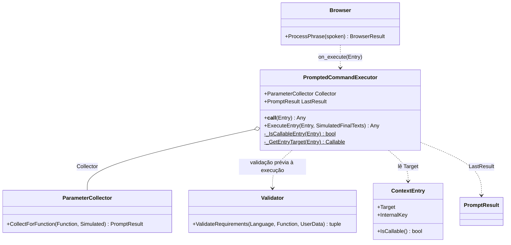
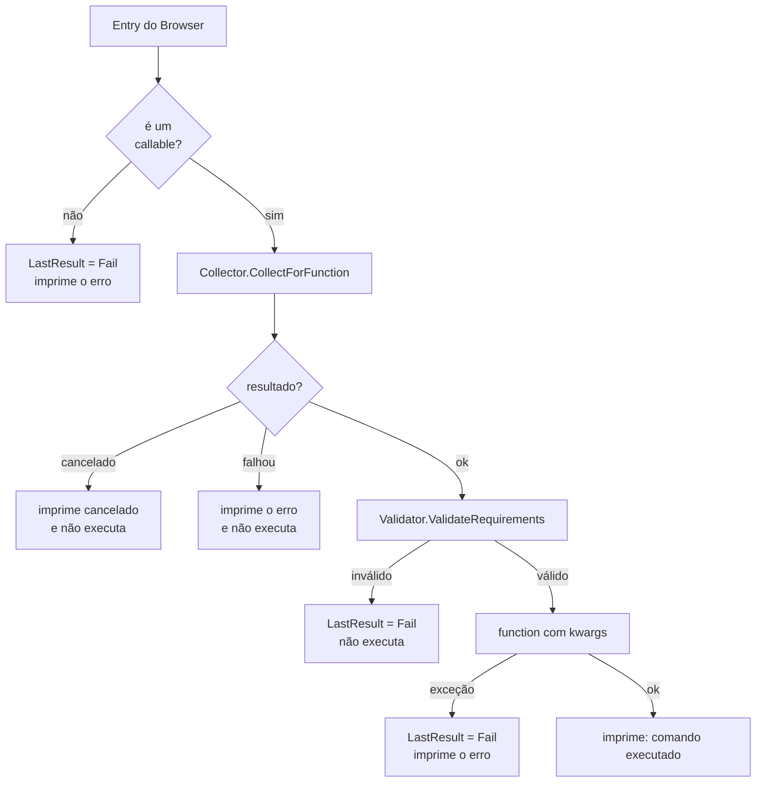

# PromptedCommandExecutor

> **Arquivo:** `Dav/scr/ComponentesDAV/IntegracionGUI/GUIFreeCad/InputPrompts/PromptedCommandExecutor.py`

O **executor de comandos** do `Browser`. É passado como `on_execute` e, toda vez
que o `Browser` resolve uma frase para uma função, ela é entregue aqui. Se a
função pede parâmetros, ele os coleta por voz; se não, chama-a diretamente.

## Passos de `ExecuteEntry`

## Notas de design

- **Uma função sem parâmetros obrigatórios não abre nenhum diálogo**: o coletor
  devolve `Ok({})` e a função é chamada com `function()`.
- **As mensagens vão para o console do FreeCAD** (`App.Console.PrintMessage` / `PrintError`)
  e, se o FreeCAD não está presente (testes), para `print`.
- **O `Validator` é aplicado duas vezes de propósito:** dentro do coletor e novamente logo
  antes de executar, como camada de verificação prévia. Se a sua integração falhar por um
  problema de importação, apenas avisa e executa com os valores já coletados.
- **`LastResult`** deixa o último resultado consultável, útil em testes.
- É construído em `integration/voice_bootstrap.py` com o idioma das preferências.
