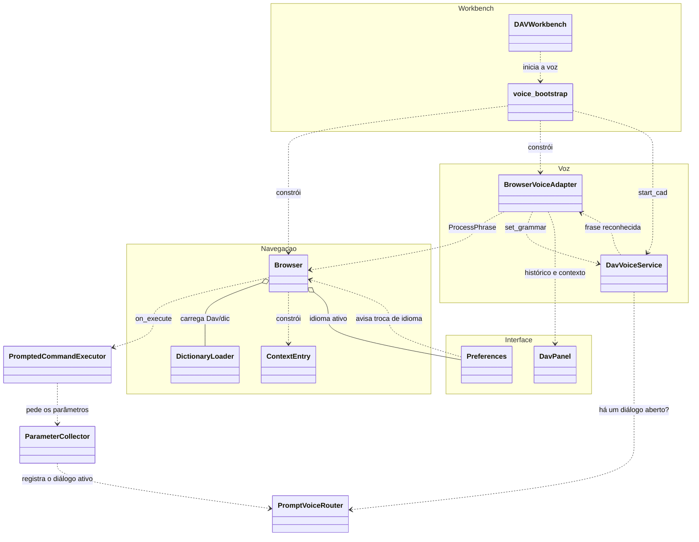
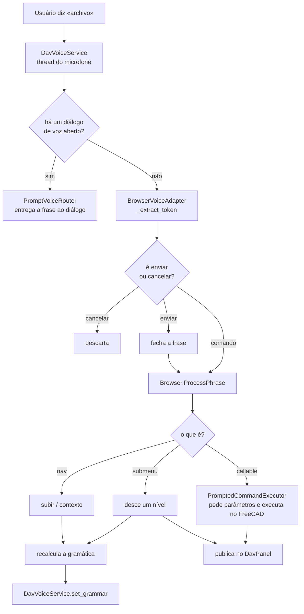

# Diagramas de classes — DAV

Um arquivo por classe, com o nome da classe. Cada um tem o diagrama em
Mermaid, a tabela de responsabilidades e as notas de design que não aparecem na
assinatura dos métodos.

> Antes isto era um único `diagramas_clases_DAV.md`. Foi separado e atualizado:
> documentava `MainWindow` e `VoiceWorker`, que já não existem (veja
> [`concluidos-dav.md`](../concluidos-dav.md)).

## Motor de navegação

| Classe | Papel |
| --- | --- |
| [`Browser`](Browser.md) | Percorre a árvore de `Dav/dic/` e resolve cada frase |
| [`ContextEntry`](ContextEntry.md) | Uma entrada do contexto: frase → chave → target |
| [`DictionaryLoader`](DictionaryLoader.md) | Carrega os módulos do dicionário a partir do disco |

## Voz

| Classe | Papel |
| --- | --- |
| [`DavVoiceService`](DavVoiceService.md) | Singleton do microfone e do recognizer Vosk |
| [`BrowserVoiceAdapter`](BrowserVoiceAdapter.md) | Une a voz ao `Browser` e publica no painel |

Como a gramática é restringida ao contexto:
[`encurtador-gramatica-vosk.md`](../encurtador-gramatica-vosk.md).

## Diálogos de voz (InputPrompts)

Como um valor é coletado por voz, de ponta a ponta:
[`FluxoComandoComParametros`](FluxoComandoComParametros.md).

### Os diálogos

| Classe | Papel |
| --- | --- |
| [`BaseInputPrompt`](BaseInputPrompt.md) | Janela base de todos os diálogos: mensagem, estado, texto ouvido e resultado |
| [`NumericInputPrompt`](NumericInputPrompt.md) | Número ditado em várias frases (`IntegerInputPrompt` e `FloatInputPrompt` o especializam) |
| [`YesNoInputPrompt`](YesNoInputPrompt.md) | Pergunta de sim ou não |
| [`ObjectSelectionInputPrompt`](ObjectSelectionInputPrompt.md) | Escolhe um objeto do documento percorrendo-os |
| [`FileSelectionInputPrompt`](FileSelectionInputPrompt.md) | Navega por pastas e escolhe um arquivo ou uma pasta |
| [`PlaneSelectionInputPrompt`](PlaneSelectionInputPrompt.md) | Escolhe o plano ou a face onde desenhar um esboço |
| [`ChoiceInputPrompt`](ChoiceInputPrompt.md) | Escolhe uma opção entre poucas (p. ex. relevo ou furo) |
| [`SpellingInputPrompt`](SpellingInputPrompt.md) | Monta um texto letra por letra |
| [`ExampleChoiceInputPrompt`](ExampleChoiceInputPrompt.md) | Escolhe um exemplo guiado com voltar / avançar / enviar |
| [`GuidedExampleInputPrompt`](GuidedExampleInputPrompt.md) | Reproduz um exemplo quadro a quadro (não modal) |
| [`ExampleStep`](ExampleStep.md) | Um quadro: texto, palavras a dizer e ação |

### O que os faz funcionar

| Classe | Papel |
| --- | --- |
| [`PromptedCommandExecutor`](PromptedCommandExecutor.md) | Executa o comando que o `Browser` resolveu, coletando antes os seus parâmetros |
| [`ParameterCollector`](ParameterCollector.md) | Pede cada parâmetro com o diálogo correspondente ao seu tipo |
| [`PromptVoiceRouter`](PromptVoiceRouter.md) | Registro de qual diálogo recebe o que é dito |
| [`PlaneGrammarSwitcher`](PlaneGrammarSwitcher.md) | Restringe a gramática do Vosk às palavras de um diálogo |
| [`NumericGrammarSwitcher`](NumericGrammarSwitcher.md) | Troca a gramática para a de ditado de números |
| [`SpokenNumberParser`](SpokenNumberParser.md) | Converte frases ditadas em números; palavras de confirmar e cancelar |

Uso completo: [`manual-esboco-e-gravacao-voz.md`](../manual-esboco-e-gravacao-voz.md).

## Validação e seleção

| Classe | Papel |
| --- | --- |
| [`Validator`](Validator.md) | Inspeciona uma função e valida e converte os dados que lhe são dados |
| [`CreateObjects`](CreateObjects.md) | Extrai faces, arestas, linhas e pontos de uma figura e os nomeia com `Tagger` |

## Dicionário

| Pasta | Papel |
| --- | --- |
| [`Examples`](Examples.md) | Submenu do Explorer: manual do usuário e exemplos guiados |

Como a árvore completa está organizada: [`Dav/dic/CONTEXT.md`](../../../dic/CONTEXT.md).

## Interface e configuração

| Classe | Papel |
| --- | --- |
| [`DavPanel`](DavPanel.md) | O widget acoplado dentro do FreeCAD |
| [`Preferences`](Preferences.md) | Idioma ativo e persistência da configuração |
| [`DAVWorkbench`](DAVWorkbench.md) | Workbench do FreeCAD e comandos da barra |
| [`Keychain`](Keychain.md) | Lê dicionários `.py` sem executá-los |
| [`IconLocator`](IconLocator.md) | Encontra o SVG de cada chave para os botões do painel |
| [`LaunchPreferences`](LaunchPreferences.md) | Abre as Preferências e aplica o tema e a voz ao fechá-las |
| [`FreecadGuiBridge`](FreecadGuiBridge.md) | Passa funções da thread de voz para a thread principal do Qt |
| [`VoiceHistory`](VoiceHistory.md) | Histórico de frases e estado do motor, compartilhados com o painel |
| [`ModelManager`](ModelManager.md) | Verifica e baixa os modelos do Vosk |

---

## Visão geral

Como as peças se conectam quando o usuário diz algo.

## O percurso de uma frase

O detalhe dos comandos com parâmetros está em [`FluxoComandoComParametros`](FluxoComandoComParametros.md).

