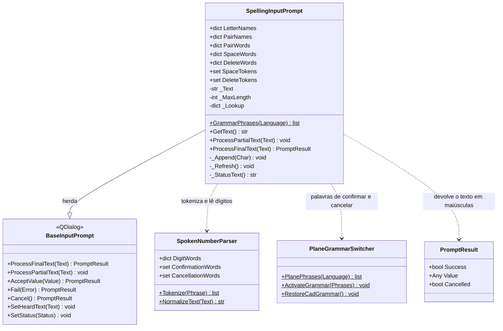
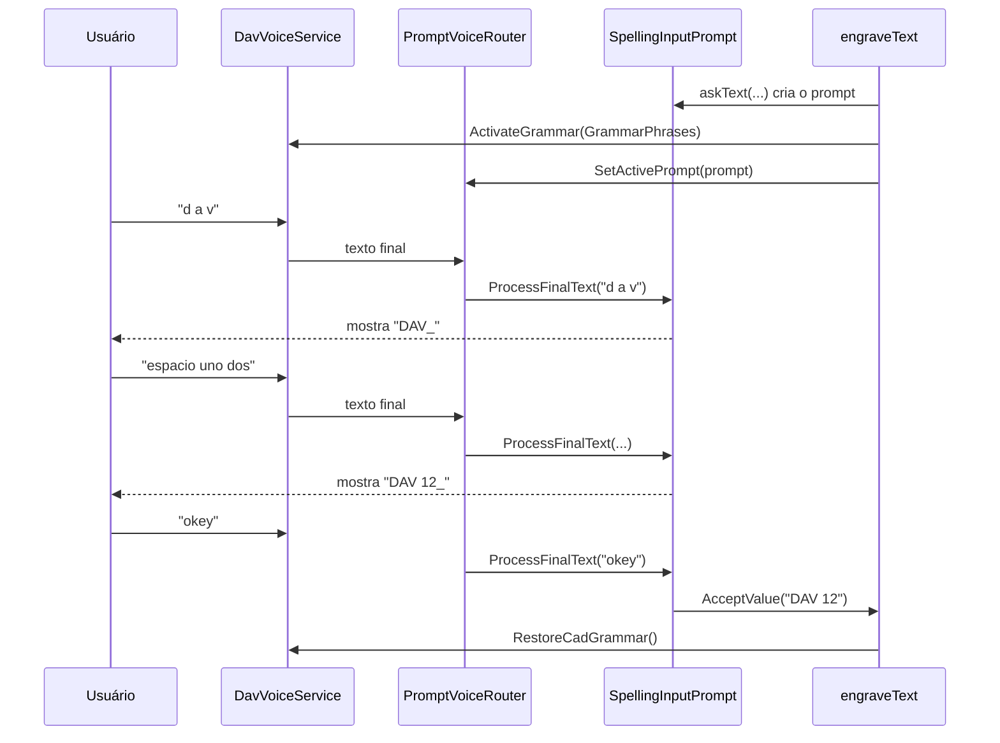

# SpellingInputPrompt

> **Arquivo:** `Dav/scr/ComponentesDAV/IntegracionGUI/GUIFreeCad/InputPrompts/SpellingInputPrompt.py`

Diálogo de voz que monta um texto **letra por letra**. É usado pelo comando
`grabar` para pedir o texto a gravar (veja
[`manual-esboco-e-gravacao-voz.md`](../manual-esboco-e-gravacao-voz.md)). O
usuário diz o nome de cada letra, dígitos, `espacio`, `borrar` e `okey`.

## Responsabilidades

| Método | O que faz |
| --- | --- |
| `ProcessFinalText(Text)` | Percorre as palavras da frase: aplica letras, dígitos, `espacio` e `borrar`; corta na primeira palavra de confirmação (`okey`…) e aceita o texto. Uma palavra de cancelamento aborta tudo |
| `GrammarPhrases(Language)` | Palavras que o Vosk deve ouvir enquanto se soletra: nomes de letra do idioma, dígitos, `espacio`, `borrar`, confirmação e cancelamento (sem `arriba`/`abajo`) |
| `GetText()` | Texto montado até agora |
| `ProcessPartialText(Text)` | Ignora os parciais: uma letra só conta quando chega o resultado final |

## Percurso de uma frase

## Notas de design

- **Gramática restrita.** Com o vocabulário aberto de um modelo pequeno, as
  letras soltas se confundem com qualquer palavra. Por isso, enquanto o prompt
  está ativo, o Vosk só ouve as palavras de `GrammarPhrases`.
- **Um idioma na gramática, três ao fazer o parsing.** A gramática lista apenas os
  nomes de letra do idioma ativo, mas `_Lookup` reúne os três idiomas: se o
  usuário diz uma letra em outro idioma, ela é entendida do mesmo jeito.
- **As tabelas só têm palavras que o Vosk conhece.** Foram conferidas contra o
  vocabulário dos modelos pequenos. O que falta se diz de outra forma: em
  português `fê`, `n` e `duplo vê` (F, N e W); em espanhol a `ñ` é aceita como
  `ñ` solta ou `eñe`, embora o modelo pequeno só conheça a primeira.
- **Letras de duas palavras** (`doble uve`, `i griega`) são resolvidas olhando a
  palavra seguinte antes de interpretar a primeira; `i` sozinha é a letra I.
- **O Ñ é protegido antes de normalizar.** `SpokenNumberParser.NormalizeText`
  remove os acentos e `ñ` viraria `n`, então `eñe` e `ñ` são substituídos por
  um marcador interno antes de tokenizar.
- **Letras soltas.** O Vosk às vezes devolve a letra pura (`d`, `v`); aceita-se
  qualquer caractere alfabético de uma única letra.
- **Apenas dígitos soltos.** Usam-se as entradas de `DigitWords` de um caractere;
  `veinticuatro` ou `diez` não são reconhecidos e são ignorados sem aviso.
- **Saída em maiúsculas**, com um máximo de 40 caracteres (`MaxLength`).
