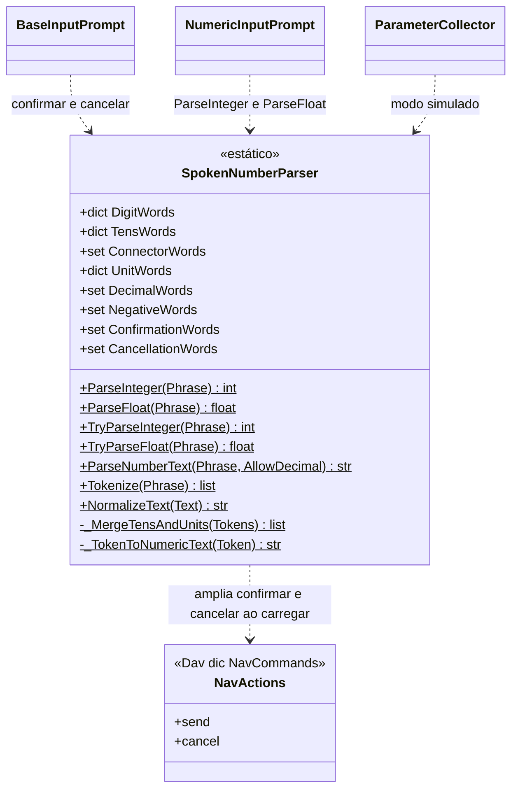
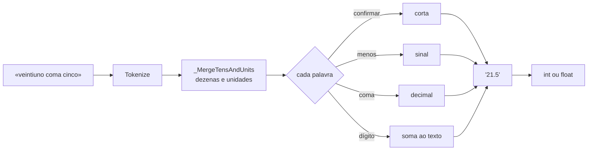

# SpokenNumberParser

> **Arquivo:** `Dav/scr/ComponentesDAV/IntegracionGUI/GUIFreeCad/InputPrompts/SpokenNumberParser.py`

Converte **frases ditadas em números** («veintiuno coma cinco» → `21.5`) e oferece
as ferramentas de texto que todos os prompts usam: normalizar sem acentos,
tokenizar e as palavras de confirmar e cancelar. É uma classe apenas com métodos
de classe, sem estado por instância.

## Responsabilidades

| Método | O que faz |
| --- | --- |
| `NormalizeText(Text)` | Minúsculas, sem acentos nem eñes; a vírgula vira ponto decimal |
| `Tokenize(Phrase)` | Normaliza e separa em palavras e números |
| `ParseNumberText(Phrase, AllowDecimal)` | Monta o número como texto: dígitos, sinal (`menos`) e separador decimal (`coma`, `punto`) |
| `ParseInteger` / `ParseFloat` | Convertem para `int` / `float`; lançam `ValueError` se a frase não é um número |
| `TryParseInteger` / `TryParseFloat` | Igual, mas devolvem `None` em vez de lançar |

## Como um número é lido

## Notas de design

- **Três idiomas em uma única tabela.** As palavras de qualquer idioma são aceitas ao
  mesmo tempo; não é preciso saber em que idioma foi ditado.
- **Confirmar e cancelar são ampliados ao importar o módulo.** `_LoadNavWordsFromDictionaries`
  soma as frases de `NavCommands/TraduceTo*.py` que apontam para `send` e `cancel`. Assim, um
  novo sinônimo adicionado ao dicionário funciona em todos os prompts sem mexer no código.
  Se o dicionário não está disponível, ficam as palavras básicas escritas na classe.
- **`ConnectorWords`** («y» / «e») une dezenas e unidades: «treinta y cinco».
- Limites e proposta de melhoria do ditado numérico:
  [`numeros-por-voz-limites-e-proposta.md`](../numeros-por-voz-limites-e-proposta.md).
