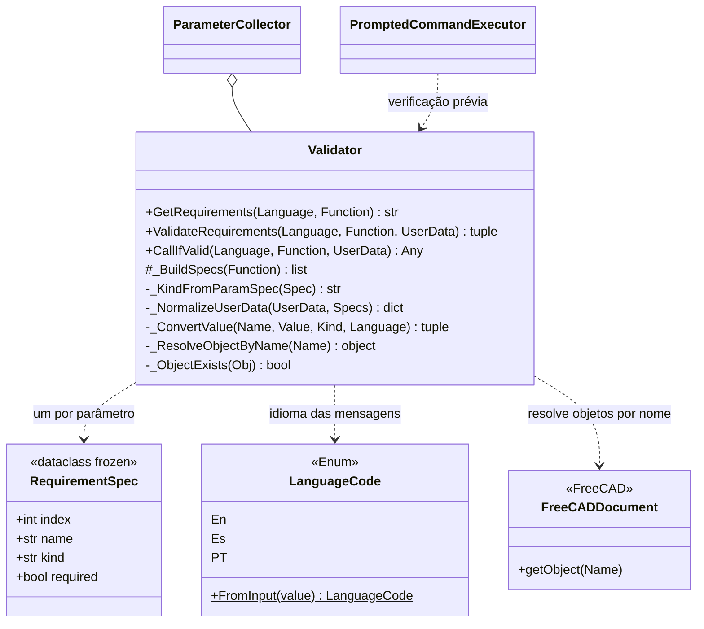

# Validator

> **Arquivo:** `Dav/scr/validation/validator.py`

Inspeciona uma função do dicionário e **valida os valores que serão
passados a ela**: quais parâmetros pede, de que tipo e se são obrigatórios; depois converte os
dados do usuário para esses tipos. As mensagens saem no idioma ativo. Não depende da
voz: recebe dados e devolve dados.

## Tipos suportados

| `kind` | Espera-se | Origem |
| --- | --- | --- |
| `int` | Um inteiro | anotação `int` |
| `float` | Um número decimal | anotação `float` |
| `str` | Um texto | anotação `str` |
| `object` | Um objeto do documento | qualquer outra anotação ou nenhuma |

## Responsabilidades

| Método | O que faz |
| --- | --- |
| `GetRequirements(Language, Function)` | Imprime e devolve uma linha por parâmetro («Dado1: espera-se um inteiro») |
| `ValidateRequirements(...)` | Converte os dados. Se falta um obrigatório ou um tipo não confere, **imprime** os erros e devolve `(False, None)`; senão, `(True, kwargs)` |
| `CallIfValid(...)` | Valida e chama `Function(**kwargs)`; devolve `None` se não validar |
| `_BuildSpecs(Function)` | Lê `Function._param_specs` se existir; senão, a assinatura com `inspect` (ignora `*args` e `**kwargs`) |
| `_NormalizeUserData` | Aceita um `dict` por nome ou uma lista posicional |
| `_ConvertValue` | Converte para o tipo pedido ou devolve um erro localizado |
| `_ResolveObjectByName` | Para `object`, busca o objeto por nome no documento ativo |

## Notas de design

- **Um parâmetro com valor padrão é opcional** (`required=False`) e não é pedido por voz.
- **Erros localizados** nos três idiomas: parâmetro ausente, tipo incorreto, objeto
  inexistente, sem documento ativo, não foi possível converter.
- **Não abre diálogos nem escuta:** isso é do [`ParameterCollector`](ParameterCollector.md).
  Por isso pode ser testado isoladamente (`validation/run_tests.py`, `test_validator.py`).
- Documentação de testes: `Dav/scr/validation/docs/`.
