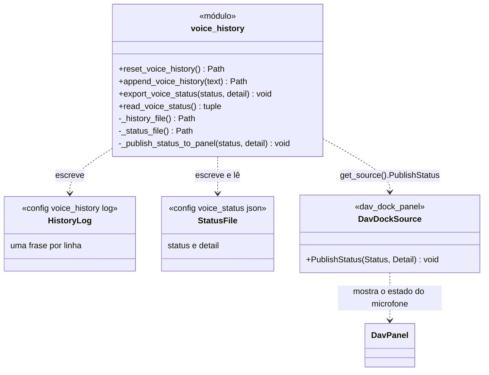

# VoiceHistory

> **Arquivo:** `Dav/scr/ComponentesDAV/IntegracionGUI/GUIFreeCad/integration/voice_history.py`

Módulo de funções que guarda duas coisas **compartilhadas entre o motor de voz e a
interface**: o histórico de frases ditas e o estado do motor (ouvindo,
inativo, erro…). São arquivos na pasta `config/`, de modo que qualquer parte do
programa pode lê-los sem se conhecerem.

## Responsabilidades

| Função | O que faz |
| --- | --- |
| `reset_voice_history()` | Esvazia o histórico (ao iniciar uma sessão de voz) |
| `append_voice_history(text)` | Adiciona uma linha ao final |
| `export_voice_status(status, detail)` | Escreve o estado em JSON e o **publica no painel** |
| `read_voice_status()` | Lê o estado; devolve `("inactive", ...)` se o arquivo não existe ou está corrompido |

## Notas de design

- **`export_voice_status` é o único ponto pelo qual passa toda mudança de estado**, de modo
  que é ali que o painel é avisado. O indicador do microfone não depende de que alguém
  se lembre de notificá-lo.
- **Publicar no painel nunca derruba o motor:** se o painel não está montado ou lança um
  erro, é ignorado.
- **A pasta `config/`** é procurada subindo pelos ancestrais do arquivo; se não aparecer,
  é criada ao lado de `integration/`.
- **Quem escreve:** o [`BrowserVoiceAdapter`](BrowserVoiceAdapter.md) adiciona cada frase e
  o seu resultado com `append_voice_history`; `voice_bootstrap.py` reinicia o histórico ao
  iniciar a voz e exporta os estados (`active`, `error`…).
