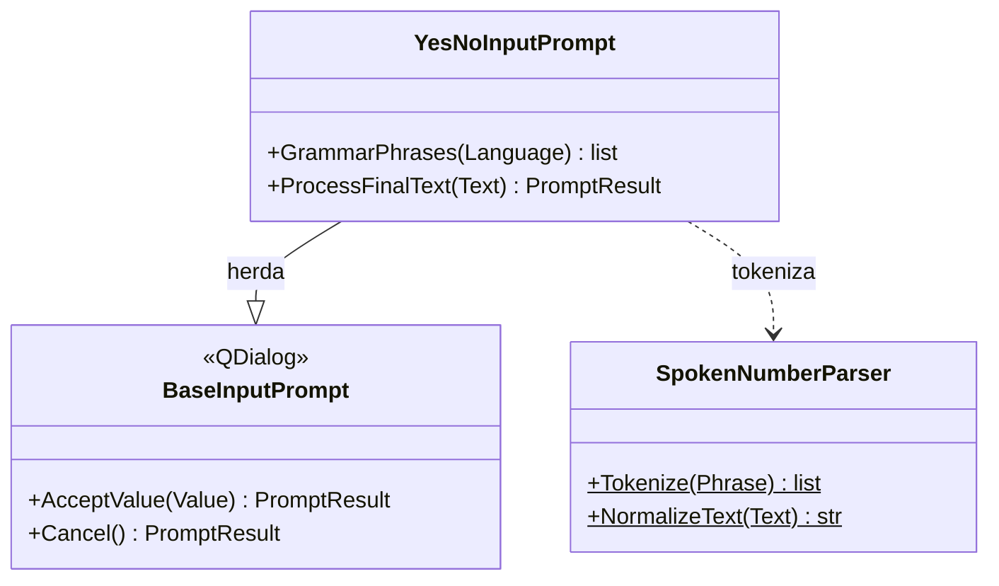

# YesNoInputPrompt

> **Arquivo:** `Dav/scr/ComponentesDAV/IntegracionGUI/GUIFreeCad/InputPrompts/YesNoInputPrompt.py`

Pergunta que se responde com **sim** ou **não**. O valor aceito é `True` ou `False`.
Para sair sem responder diz-se *cancelar*: `no` é uma resposta, não um
cancelamento. É aberta com `askYesNo` (`Workbench/_prompts.py`); por exemplo, `Correction`
a usa para confirmar antes de apagar.

## Palavras

| Resposta | es | en | pt |
| --- | --- | --- | --- |
| Sim (`True`) | si, okey, ok, dale, aceptar, confirmar, listo, vale | yes, yep, okey, ok, accept, confirm | sim, okey, ok, aceitar, confirmar, pronto |
| Não (`False`) | no, negativo | no, nope, negative | não, negativo |
| Cancelar | cancelar, cancela, abortar, anular, descartar | cancel, abort, discard | cancelar, cancelamento, abortar, anular |

São comparadas sem acentos e nos três idiomas ao mesmo tempo; a gramática do Vosk é restrita
ao idioma ativo com `GrammarPhrases`.

## Notas de design

- **Ordem de avaliação:** cancelar, depois não, depois sim. Assim uma frase com «no» e
  «okey» conta como *não*.
- **O botão *Aceitar* da janela responde «sim»**: substitui-se o do prompt base,
  que devolveria o texto ouvido.
- Uma frase que não coincide com nada apenas atualiza o estado («No te entendí»), sem
  fechar o diálogo.
