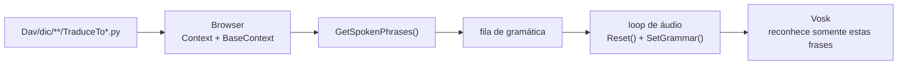
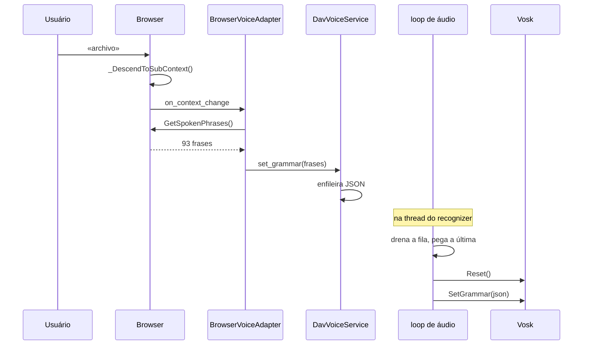

# Encurtador de gramática do Vosk

Como o DAV limita o que o reconhecedor pode ouvir aos comandos válidos do
contexto de navegação ativo, em vez de deixá-lo competir contra o vocabulário
inteiro do modelo.

Resolvido no PR #178 (integra o #176 de SoPerez1).

---

## O problema

O `vosk-model-small-es-0.42` carrega **100.001 palavras**. A árvore `Dav/dic/` usa
**745** (0,75 %), e a mediana por contexto é de **12 frases**.

Sem gramática, o Vosk escolhe a palavra mais provável entre as 100.001 em cada
frase. Daí os sintomas registrados: «croquis» transcrito como «crockett»,
um «traffic» que ninguém disse.

Não se resolve com um modelo maior — isso melhora o modelo acústico, não a
competição por frase. Resolve-se restringindo o vocabulário candidato.

---

## A ideia

Em qualquer momento da navegação, o conjunto de coisas que o usuário
*pode* dizer é pequeno e conhecido: os comandos do nível onde ele está, os
saltos para a raiz e os verbos de navegação. Essa lista é passada ao Vosk como
gramática, e o reconhecedor deixa de considerar todo o resto.

Ao mudar de nível, a gramática é recalculada.



---

## De onde saem as frases

`Browser.GetSpokenPhrases()` ([`navigation/browser.py`](../../scr/ComponentesDAV/IntegracionGUI/GUIFreeCad/navigation/browser.py))
reúne quatro fontes, **todas do dicionário**:

| Fonte | De onde sai | Exemplo na raiz |
| --- | --- | --- |
| `self.Context` | O `TraduceTo*.py` da pasta onde está posicionado | `archivo`, `banco de trabajo` |
| `self.BaseContext` | Chaves internas do nível raiz | `explorer` |
| `_base_translate` | `Dav/dic/TraduceTo*.py` — saltos para a raiz a partir de qualquer nível | `explorador`, `dibujar` |
| `_nav_translate` | `Dav/dic/NavCommands/TraduceTo*.py` | `subir`, `volver`, `contexto`, `enviar`, `cancelar` |

De cada entrada ele toma **duas** coisas: a frase falada (`Spoken`) e a chave
interna (`InternalKey`). Por isso na gramática convivem `explorador` (espanhol)
e `explorer` (chave interna).

A única coisa que **não** sai do dicionário é `[unk]`, o curinga com que o Vosk
absorve ruído e palavras fora de contexto sem forçar um comando incorreto.

> **Adicionar um sinônimo é editar um `TraduceTo*.py`.** Não é preciso mexer em
> `browser.py` nem em nada do motor de voz: a palavra aparece na gramática ao
> reiniciar. Isso vale também para `enviar` e `cancelar`, que até o PR #178
> estavam escritos em três lugares do código.

### Tamanhos reais

Medidos em uma sessão dentro do FreeCAD, em espanhol:

| Contexto | Frases |
| --- | --- |
| Raiz | 54 |
| Arquivo | 93 |
| Arquivo → Novo | 120 |
| Sketcher | 199 |
| Preferências (`all_grammar_phrases()`) | 82 |

Contra as 100.001 do modelo aberto.

---

## Como é aplicada

A gramática é aplicada **dentro da thread dona do recognizer**, nunca a partir da
thread da GUI. Quem navega apenas enfileira; o loop de áudio consome.



### Por que `Reset()` antes de `SetGrammar()`

**O Vosk aborta o processo** se a gramática for trocada em um recognizer que já
processou áudio:

```
SetGrm():recognizer.cc:235
"Can't add speaker model to already running recognizer"
```

Não é uma exceção do Python: nenhum `try/except` a captura, e ela derruba o
FreeCAD inteiro. No `crash.log` do FreeCAD aparece como `Recognizer::SetGrm`.

Verificado contra o modelo `pt` em processos separados:

| cenário | resultado |
| --- | --- |
| `SetGrammar` antes de qualquer áudio | ok |
| `SetGrammar` depois de áudio | **ERRO → crash** |
| `Reset()` + `SetGrammar` | ok |

`Reset()` devolve o recognizer ao estado inicial e aí sim ele aceita a gramática
nova.

### Por que apenas a última da fila

Se várias gramáticas foram enfileiradas enquanto o loop estava em `AcceptWaveform`,
as intermediárias já não descrevem o contexto atual. Aplicá-las todas fazia
com que as gramáticas de preferências (82 frases) e de CAD (54) se atropelassem
alternando-se, e como cada aplicação faz `Reset()` —que descarta o áudio
parcialmente reconhecido— **nenhuma frase chegava a ser concluída**. O microfone
parecia morto.

O loop drena a fila, fica com a última e não a reaplica se for igual à
vigente.

---

## Os dois modos

O `DavVoiceService` atende dois consumidores com gramáticas distintas:

| Modo | Gramática | Origem |
| --- | --- | --- |
| `cad` | Contexto de navegação ativo | `Browser.GetSpokenPhrases()` |
| `preferences` | 81 frases de configuração + `[unk]` | `speech/voice_commands.all_grammar_phrases()` |

Ao fechar Preferências, `detach_preferences()` → `resume_cad_voice()` restaura a
gramática de CAD.

---

## Limites conhecidos

**A gramática restringe o vocabulário, não a sintaxe.** O Vosk pode combinar
várias palavras válidas em uma frase sem sentido. No log apareceram coisas
como `«extender oblongo»` ou `«editar de trabajo crear vistas estándar»`: nenhuma
executou nada, mas isso mostra que com 199 frases ativas (Sketcher) há mais
superfície para o ruído se encaixar em algo.

**Palavras que não estão no modelo não podem ser reconhecidas.** Se um
`TraduceTo*.py` adiciona uma palavra que o modelo Vosk não conhece, ela entra na
gramática mas nunca vai casar. O `SetGrammar` não avisa: falha em silêncio.

**A gramática e o modelo têm que ser do mesmo idioma.** Aplicar uma
gramática em espanhol sobre o modelo português não lança exceção, simplesmente
deixa de reconhecer tudo.

---

## Diagnóstico

Tudo isso fica registrado em `config/dav.log` (ver
[`core/dav_log.py`](../../scr/ComponentesDAV/IntegracionGUI/GUIFreeCad/core/dav_log.py)):

```
14:44:03  cad: frase reconocida 'archivo'
14:44:03  aplicando gramatica: 120 frases
14:44:03  gramatica aplicada
```

O «aplicando» é escrito **antes** de chamar `SetGrammar`: se o log cortar ali,
sem o «gramatica aplicada» que lhe segue, essa gramática é a que derrubou o
processo.

Sinais de que algo está errado:

- Gramáticas se alternando sem que o usuário navegue (`82 / 54 / 82 / 54`) → dois
  modos disputando o recognizer.
- `aplicando` sem o seu `gramatica aplicada` → crash em `SetGrammar`.
- Nenhuma linha de gramática em toda a sessão → o encurtador não está entrando e
  o Vosk reconhece contra o modelo completo.

---

## Arquivos

| Arquivo | Papel |
| --- | --- |
| `navigation/browser.py` | `GetSpokenPhrases()`, `GetNavWords()` |
| `speech/dav_voice_service.py` | Fila de gramática, `Reset()` + `SetGrammar()` no loop |
| `integration/browser_voice_adapter.py` | Enfileira ao mudar de contexto |
| `speech/voice_commands.py` | `all_grammar_phrases()` do modo preferências |
| `Dav/dic/NavCommands/` | `subir`, `contexto`, `enviar`, `cancelar` |
| `Dav/dic/**/TraduceTo*.py` | Todo o resto do vocabulário |
