# GitFlow do DAV: histórico real do repositório

Reconstruído a partir de `git log --all` (776 commits, 176 merges, 2026-04-27 → 2026-09-25).
As branches `Pruebas`, `DavCore`, `davcore-integracion` e `hot-fix-v1.0.1` já foram apagadas do
remoto; são reconstruídas a partir dos commits de merge e das tags. Cada nó resume um grupo de
commits; o número `#N` é o Pull Request do GitHub.

## Gráfico

```mermaid
%%{init: { 'gitGraph': { 'mainBranchName': 'main', 'rotateCommitLabel': true } } }%%
gitGraph
    commit id: "Initial commit (04-27)"
    commit id: "Init"
    commit id: "Init v1 (04-29)"

    %% ============ FASE 1: Pruebas (integração, maio-junho) ============
    branch Pruebas
    checkout Pruebas
    commit id: "GestorDeHilos + modelo Vosk (05-06)"
    branch "forks-Pruebas"
    checkout "forks-Pruebas"
    commit id: "PR forks julianAO2002 #1 #7 (05-11)"
    checkout Pruebas
    merge "forks-Pruebas" id: "merge forks (05-11)"
    commit id: "DAV GUI + init.py (05-16)"

    checkout main
    commit id: "Structure (05-16)"
    commit id: "Structure v1"
    branch DavCore
    checkout main
    commit id: "Update issue templates"

    checkout Pruebas
    commit id: "Licença GPL + IEEE-830 (05-18)"
    commit id: "Módulo de voz Vosk + comandos (05-18)"
    commit id: "Workbench DAV + GUI temas/idiomas (05-22)"
    commit id: "Explorer + dicionários Draft/TechDraw/Part (05-23)"
    checkout "forks-Pruebas"
    commit id: "PR #61 #68 #69 #86 #89 (05-25 a 05-30)"
    checkout Pruebas
    merge "forks-Pruebas" id: "merge forks (05-30)"

    branch "task/traduce-feature"
    checkout "task/traduce-feature"
    commit id: "TraduceTo ES/EN/PT"
    checkout Pruebas
    merge "task/traduce-feature" id: "PR #70 (05-28)"

    branch "lucas/sketcher-issue75"
    checkout "lucas/sketcher-issue75"
    commit id: "Sketcher issue 75"
    checkout Pruebas
    merge "lucas/sketcher-issue75" id: "PR #88 (05-31)"

    branch "feat/diccionarios-sketcher"
    checkout "feat/diccionarios-sketcher"
    commit id: "Dicionários Sketcher"
    checkout Pruebas
    merge "feat/diccionarios-sketcher" id: "PR #90 (05-31)"

    commit id: "Reestruturação ComponentesDAV + ícones SVG (06-08)"
    checkout "forks-Pruebas"
    commit id: "PR #95 #96 #113 #115-#117 (06-03 a 06-11)"
    checkout Pruebas
    merge "forks-Pruebas" id: "merge forks (06-11)"
    checkout "forks-Pruebas"
    commit id: "PR #134-#139 #162 #163 (06-15 a 06-22)"
    checkout Pruebas
    merge "forks-Pruebas" id: "merge forks (06-22)"
    commit id: "Copyright + traduções ES (06-23)"

    %% ============ FASE 2: DavCore (integração, junho-setembro) ============
    branch "davcore-integracion"
    checkout "davcore-integracion"
    commit id: "Reestruturação para layout Dav/scr, Dav/dic (06-24)"
    commit id: "Módulo validation/Validator"
    checkout DavCore
    merge "davcore-integracion" id: "PR #166 (06-24)"
    checkout "davcore-integracion"
    commit id: "AVANÇOS dicionários (06-25)"
    checkout DavCore
    merge "davcore-integracion" id: "PR #167 (06-25)"
    commit id: "Completed dictionaries (08-03)"
    checkout main
    merge DavCore id: "PR #169 DavCore para main (08-03)"

    checkout "davcore-integracion"
    commit id: "Integração de voz #170 #172 #173 (08-06/07)"
    checkout DavCore
    merge "davcore-integracion" id: "PR #173 (08-07)"

    branch "Tade-Cami-Mica"
    checkout "Tade-Cami-Mica"
    commit id: "Tade-Cami-Mica (08-07)"
    checkout DavCore
    merge "Tade-Cami-Mica" id: "PR #174 (08-09)"

    checkout "davcore-integracion"
    commit id: "Integração de voz #175 #177 #178 #179 (08-09/10)"
    checkout DavCore
    merge "davcore-integracion" id: "PR #179 (08-10)"

    branch "forks-DavCore"
    checkout "forks-DavCore"
    commit id: "Gramática Vosk por contexto - SoPerez1 #176 (08-10)"
    checkout DavCore
    merge "forks-DavCore" id: "PR #176 (08-10)"

    %% Abrilpoggio-patch-3: para main, revertido, e reaplicado em DavCore
    checkout main
    branch "Abrilpoggio-patch-3"
    checkout "Abrilpoggio-patch-3"
    commit id: "Patch README (web)"
    checkout main
    merge "Abrilpoggio-patch-3" id: "PR #182 (08-14)"
    branch "revert-182"
    checkout "revert-182"
    commit id: "Revert PR #182"
    checkout main
    merge "revert-182" id: "PR #186 revert (08-14)"
    checkout DavCore
    merge "Abrilpoggio-patch-3" id: "PR #187 reaplicado em DavCore (08-14)"

    branch "techDraw_-SketcherGeometry"
    checkout "techDraw_-SketcherGeometry"
    commit id: "TechDraw + geometria Sketcher"
    checkout DavCore
    merge "techDraw_-SketcherGeometry" id: "PR #181 (08-16)"

    checkout "forks-DavCore"
    commit id: "juan-mrtn #184, brianschelll #185 (08-16)"
    checkout DavCore
    merge "forks-DavCore" id: "PR #185 (08-16)"

    branch "feature-partdesign-benja"
    checkout "feature-partdesign-benja"
    commit id: "PartDesign por voz"
    checkout DavCore
    merge "feature-partdesign-benja" id: "PR #192 (08-16)"

    branch "feature-pointplacement-benja"
    checkout "feature-pointplacement-benja"
    commit id: "Point placement"
    checkout DavCore
    merge "feature-pointplacement-benja" id: "PR #193 (08-18)"

    checkout "Tade-Cami-Mica"
    commit id: "Merge DavCore + fix run_interfaz.bat (08-18)"
    checkout DavCore
    merge "Tade-Cami-Mica" id: "PR #183 (08-18)"

    branch "fix/createobjects-draftwork"
    checkout "fix/createobjects-draftwork"
    commit id: "Fix CreateObjects Draft"
    checkout DavCore
    merge "fix/createobjects-draftwork" id: "PR #194 (08-18)"

    checkout main
    branch "chore/remove-agents-issuetemplate"
    checkout "chore/remove-agents-issuetemplate"
    commit id: "Remover AGENTS e issue template"
    checkout main
    merge "chore/remove-agents-issuetemplate" id: "PR #195 (08-18)"

    checkout "forks-DavCore"
    commit id: "brianschelll #196 (08-23)"
    checkout DavCore
    merge "forks-DavCore" id: "PR #196 (08-23)"

    branch ramatemporal
    checkout ramatemporal
    commit id: "Branch temporária"
    checkout DavCore
    merge ramatemporal id: "PR #199 (08-28)"

    checkout "forks-DavCore"
    commit id: "MaitenBlanc #201 (08-28)"
    checkout DavCore
    merge "forks-DavCore" id: "PR #201 (08-28)"

    branch "fix-techdraw-commands"
    checkout "fix-techdraw-commands"
    commit id: "Fix comandos TechDraw"
    checkout DavCore
    merge "fix-techdraw-commands" id: "PR #203 (08-30)"

    checkout "forks-DavCore"
    commit id: "Elluis1 techdraw-lista1 #207 (08-31)"
    checkout DavCore
    merge "forks-DavCore" id: "PR #207 (08-31)"

    checkout "davcore-integracion"
    commit id: "Integração #208 #209 #213 #215-#217 (08-31)"
    checkout DavCore
    merge "davcore-integracion" id: "PR #217 (08-31)"

    branch "docs/pruebas-draftwork"
    checkout "docs/pruebas-draftwork"
    commit id: "Relatório de testes Draft"
    checkout DavCore
    merge "docs/pruebas-draftwork" id: "PR #214 (08-31)"

    branch "traducciones-joint"
    checkout "traducciones-joint"
    commit id: "Traduções joints"
    checkout DavCore
    merge "traducciones-joint" id: "PR #200 (08-31)"

    branch "feature/selector-plano-voz"
    checkout "feature/selector-plano-voz"
    commit id: "Seletor de plano por voz"
    checkout DavCore
    merge "feature/selector-plano-voz" id: "PR #218 (08-31)"

    branch "feature/measure-integration"
    checkout "feature/measure-integration"
    commit id: "Integração Measure"
    checkout DavCore
    merge "feature/measure-integration" id: "PR #220 (09-01)"

    branch "fix/explorer-dictionaries"
    checkout "fix/explorer-dictionaries"
    commit id: "Fix dicionários Explorer"
    checkout DavCore
    merge "fix/explorer-dictionaries" id: "PR #219 (09-04)"

    checkout "forks-DavCore"
    commit id: "juan-mrtn #197 (09-04)"
    checkout DavCore
    merge "forks-DavCore" id: "PR #197 (09-04)"

    branch "feature/geometry-voz-parametrica"
    checkout "feature/geometry-voz-parametrica"
    commit id: "Geometria paramétrica por voz"
    checkout DavCore
    merge "feature/geometry-voz-parametrica" id: "PR #223 (09-05)"

    branch "feature/guia-desarrollo"
    checkout "feature/guia-desarrollo"
    commit id: "Guia de desenvolvimento DAV"
    checkout DavCore
    merge "feature/guia-desarrollo" id: "PR #225 (09-07)"

    branch "feature/sketcher-parametric-smile"
    checkout "feature/sketcher-parametric-smile"
    commit id: "Sketcher paramétrico"
    checkout DavCore
    merge "feature/sketcher-parametric-smile" id: "PR #226 (09-08)"

    checkout "forks-DavCore"
    commit id: "brianschelll #224, MaitenBlanc #227 #228 (09-08)"
    checkout DavCore
    merge "forks-DavCore" id: "PR #228 (09-08)"

    branch "patch-branches-web"
    checkout "patch-branches-web"
    commit id: "AlexanderGBordaa-patch-1-1 (09-08)"
    checkout DavCore
    merge "patch-branches-web" id: "PR #229 (09-08)"

    branch "feat/global-dav-panel-controls"
    checkout "feat/global-dav-panel-controls"
    commit id: "Controles globais do painel DAV"
    checkout DavCore
    merge "feat/global-dav-panel-controls" id: "PR #231 (09-11)"

    checkout "patch-branches-web"
    commit id: "JoaquinPoggio-patch-1 x4 #232-#237 (09-14)"
    checkout DavCore
    merge "patch-branches-web" id: "PR #237 (09-14)"

    branch "README-Manual-usuario"
    checkout "README-Manual-usuario"
    commit id: "Manual do usuário"
    checkout DavCore
    merge "README-Manual-usuario" id: "PR #234 (09-14)"

    branch "feature/panel-commands-pt"
    checkout "feature/panel-commands-pt"
    commit id: "Comandos do painel em PT"
    checkout DavCore
    merge "feature/panel-commands-pt" id: "PR #239 (09-14)"

    checkout "patch-branches-web"
    commit id: "BiancaTournour-patch-1 (09-14)"
    checkout DavCore
    merge "patch-branches-web" id: "PR #240 (09-14)"

    checkout "forks-DavCore"
    commit id: "juan-mrtn #241 (09-14)"
    checkout DavCore
    merge "forks-DavCore" id: "PR #241 encerramento do DavCore" tag: "v1.0.0"

    %% ============ FASE 3: release 1.0 e hotfixes sobre main ============
    checkout main
    merge DavCore id: "PR #242 DavCore para main (09-14)" tag: "V.1.0"
    commit id: "Atualizar README.es.md (09-14)"

    branch "hot-fix-v1.0.1"
    checkout "hot-fix-v1.0.1"
    commit id: "GitHub Action instalador Windows (09-15)"
    branch "forks-hotfix-1.0.1"
    checkout "forks-hotfix-1.0.1"
    commit id: "Maiten #248, FDavidGallo #256 (09-18)"
    checkout "hot-fix-v1.0.1"
    merge "forks-hotfix-1.0.1" id: "PR #248 #256 (09-18)"
    checkout "forks-hotfix-1.0.1"
    commit id: "Luigi lista3 StandardViews #257 (09-19)"
    commit id: "Diálogos de voz PartDesign/Part/Assembly #258 (09-19)"
    checkout "hot-fix-v1.0.1"
    merge "forks-hotfix-1.0.1" id: "PR #257 #258 (09-19)"
    checkout "forks-hotfix-1.0.1"
    commit id: "Exemplos guiados, câmera, projeto #259-#264 (09-20)"
    checkout "hot-fix-v1.0.1"
    merge "forks-hotfix-1.0.1" id: "PR #259-#264 (09-20)"
    checkout main
    merge "hot-fix-v1.0.1" id: "PR #265 hot-fix-v1.0.1 (09-20)" tag: "v1.0.1"
    commit id: "gitignore issues (09-21)" tag: "V1.0.1"

    branch "Hot-fix-v1.0.2"
    checkout "Hot-fix-v1.0.2"
    commit id: "Estilos vista DAV e aliases de voz (09-21)"
    commit id: "Bug triângulo/retângulo, exemplo SVG (09-24)"
    commit id: "Manual do usuário PT, fix avançar (09-24)"
    commit id: "Readmes e ícones (09-25)"
    checkout main
    merge "Hot-fix-v1.0.2" id: "PR #269 Hot-fix-v1.0.2 (09-25)" tag: "v1.0.2"

    branch "hot-fix-v1.0.3"
    checkout "hot-fix-v1.0.3"
    commit id: "Conectores (09-25)"
    commit id: "Sinônimos EN/PT/ES, tema escuro, soletração (09-25)"
    commit id: "Texto: bugs e mais letras (09-25)"
    commit id: "Novo projeto (09-25)"
    checkout main
    merge "hot-fix-v1.0.3" id: "PR #271 hot-fix-v1.0.3 (09-25)" tag: "V1.0.3"
```

## Como ler

| Branch | Papel | Vida | Integra-se em |
|---|---|---|---|
| `main` | Produção / releases com tag | 04-27 → hoje | — |
| `Pruebas` | Integração da fase 1 (equipe UADER) | 05-06 → 06-23 | Seu conteúdo passa para `DavCore` via `davcore-integracion` |
| `DavCore` | Integração da fase 2, layout `Dav/scr` + `Dav/dic` | 05-16 (criada) / 06-24 → 09-14 | `main` (PR #169 e #242) |
| `davcore-integracion` | Branch longa de um fork: reestruturação + integração de voz | 06-24 → 08-31 | `DavCore` |
| `forks-*` | Colapso das branches `usuario:Pruebas` / `usuario:DavCore` de cada fork | conforme a fase | `Pruebas` / `DavCore` / hotfix |
| `feature/*`, `feat/*`, `fix/*`, `docs/*` | Uma tarefa por branch | horas a dias | `Pruebas` ou `DavCore` |
| `*-patch-N`, `patch-branches-web` | Edições feitas pela web do GitHub | mesmo dia | `DavCore` |
| `hot-fix-v1.0.x` | Correções e exemplos posteriores à 1.0 | 1 a 6 dias | `main` |

Tags: `V.1.0` (PR #242), `v1.0.0`, `v1.0.1`, `V1.0.1`, `v1.0.2`, `V1.0.3`.

## Desvios em relação ao GitFlow clássico

- **`hot-fix-v1.0.1` nasce de `DavCore`, não de `main`**: foi ramificada em `a83fb75f` (`v1.0.0`), e por isso seu PR #265 levou para `main` também o que já estava em `DavCore`.
- **Não há branch `develop`**: `Pruebas` e depois `DavCore` fazem esse papel, e nenhuma recebe os hotfixes de volta.
- **Nomes de tag misturados**: `V.1.0`/`v1.0.0` para a 1.0 e `v1.0.1`/`V1.0.1` para a 1.0.1 (duas tags em commits distintos).
- **Commits diretos em `main`** fora de PR: `Update issue templates`, `Actualizar README.es.md` e `gitignore issues`.
- **PR #182 revertido (#186) e reaplicado em `DavCore` (#187)**: a mesma branch `Abrilpoggio-patch-3` entrou por dois destinos.
- **`hot-fix-v1.0.3` incorporou `main`** com um merge (`1a9ed6dd`) antes do PR #271; não é desenhado porque `main` não havia avançado desde que a branch foi criada.
