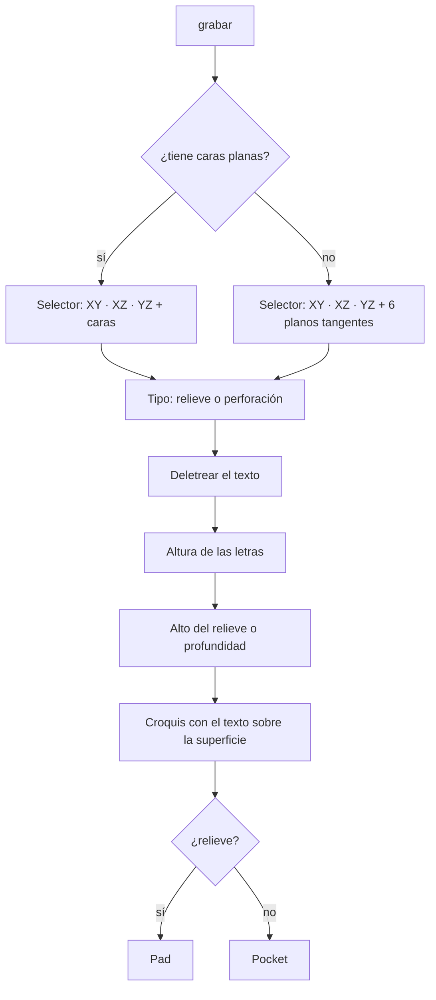
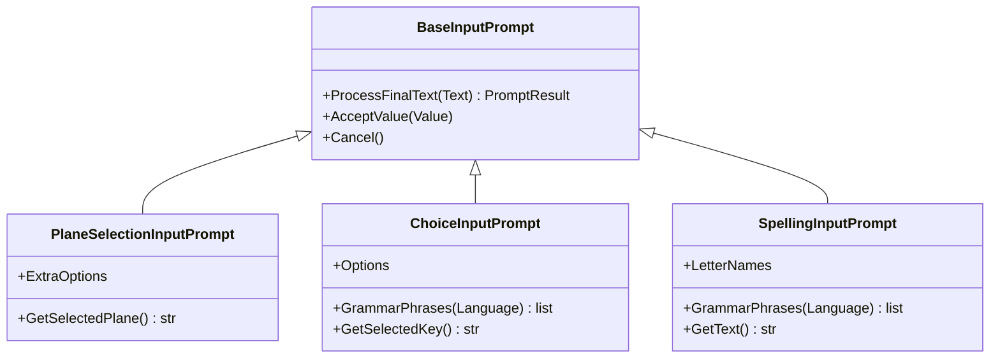

# Manual — Esboço sobre faces, furo cego, gravação de texto e revolução por voz

Cobre o que foi adicionado a **PartDesign / Sketcher / Part** para desenhar sobre
as faces de uma peça, furar sem atravessar, gravar texto (relevo ou rebaixo) e
girar perfis, tudo por voz. Inclui um exemplo completo (uma marreta), o que foi
testado, o que **não** foi testado e os problemas que apareceram pelo caminho.

As frases foram tiradas dos dicionários reais (`Dav/dic/`). Para os testes dos
comandos de PartDesign que já existiam, veja
[guia-testes-partdesign-voz.md](guia-testes-partdesign-voz.md).

> **Números:** de 0 a 99 dizem-se normalmente (`veinticinco`, `sesenta`). De 100
> em diante é preciso **soletrar** (`dos cinco cero` = 250). Palavras como
> «doscientos cincuenta» **não** dão erro: são lidas como `50`. Detalhes em
> [numeros-por-voz-limites-e-proposta.md](numeros-por-voz-limites-e-proposta.md).
>
> **Confirmar:** cada número é dito e, **em outra frase**, `okey`. Uma única frase
> como «veinte okey» **não** é aceita (verificado com `FloatInputPrompt`).

---

## Resumo das novidades

| Comando | Onde está | Frases (espanhol) |
|---|---|---|
| Esboço sobre plano **ou face** | `nuevo croquis` (novo esboço) / `nuevo boceto` no PartDesign, Part e Sketcher | as de sempre; o seletor agora lista faces |
| **Furo cego** | `restar` (subtractive) | `agujero ciego`, `agujero ciego por medidas`, `hueco ciego` |
| **Gravar texto** | `editar` (modify) | `grabar`, `grabar texto`, `serigrafiar`, `serigrafia`, `texto en relieve`, `poner texto` |
| **Fechar esboço** | Sketcher (`sketcher`, `geometry`, `tools`) | `cerrar croquis`, `cerrar boceto`, `salir del croquis`, `terminar croquis`, `finalizar croquis` |
| **Revolução** (corrigida) | `agregar` (additive) | `transformar` e `revolucion por angulo` |
| Botões de vistas ocultos | painel DAV | (sem frase: é só a GUI) |

Em inglês e português:

| Comando | Inglês | Português |
|---|---|---|
| Furo cego | `blind hole`, `blind hole by size`, `blind drill` | `furo cego`, `furo cego por medidas`, `buraco cego` |
| Gravar texto | `engrave`, `engrave text`, `emboss`, `emboss text`, `silkscreen`, `text relief` | `gravar`, `gravar texto`, `serigrafar`, `texto em relevo`, `colocar texto` |
| Fechar esboço | `close sketch`, `leave sketch`, `exit sketch`, `finish sketch` | `fechar croqui`, `fechar esboço`, `sair do croqui`, `terminar croqui`, `finalizar croqui` |

---

## 1. Esboço sobre planos e faces

Ao dizer **«nuevo croquis»** (novo esboço), o seletor mostra, nesta ordem:

1. Os três planos base: `XY`, `XZ`, `YZ` (como sempre).
2. As **faces planas** do sólido atual.

Navega-se com **arriba** (para cima) / **abajo** (para baixo) e confirma-se com
**okey** (ou **cancelar**).

- **Nomes das faces:** por para onde olham: *Cara superior, inferior, frontal,
  trasera, derecha, izquierda* (face superior, inferior, frontal, traseira,
  direita, esquerda). Se houver duas iguais, a segunda leva um `2` (*Cara superior
  2*). São oferecidas as 12 maiores.
- **Qual sólido:** o que você tiver selecionado; se não, o Body ativo; se não, o
  último corpo ou sólido de Part do documento.
- **Origem e orientação:** a origem do esboço fica no **centro da face** (assim
  ditam-se coordenadas simples como ±5) e a normal aponta para fora. Com uma face,
  o esboço entra no Body dono dessa face.
- **Sem sólido:** o seletor fica com os três planos, igual a antes.
- Funciona igual nos três bancos: o PartDesign tem sua própria versão; o de Part e
  o de Geometry do Sketcher compartilham a do Sketcher.

Código: [`_faces.py`](../../dic/Workbench/Sketcher/new_sketch/_faces.py),
[`new_sketch.py` do Sketcher](../../dic/Workbench/Sketcher/new_sketch/new_sketch.py) e
[`new_sketch.py` do PartDesign](../../dic/Workbench/PartDesign/base/new_sketch.py).

---

## 2. Furo cego

Fura **sem atravessar**, com fundo plano, no centro de cada círculo do esboço.
Pede **diâmetro** e **profundidade**.

```
diseño de pieza → restar → agujero ciego → (diâmetro) → (profundidade)
```

- Usa o esboço selecionado; se não houver, o último esboço com desenho que ainda
  não alimenta outra operação.
- Só importa o **centro** do círculo desenhado: o diâmetro vem do que você dita.
- Se o furo apontasse para fora da peça, **inverte o sentido sozinho**.

Usa-se o mesmo padrão do dado: círculos em cada face e `agujero ciego` (furo cego).

Código: `blind_hole_by_size` em
[`subtractive/_parametric.py`](../../dic/Workbench/PartDesign/subtractive/_parametric.py).

> **`agujero por medidas` continua quebrado.** Veja [Pendências](#pendencias-e-achados).

---

## 3. Gravar texto (relevo ou furo)

```
diseño de pieza → editar → grabar
```

Depois pergunta, nesta ordem:

| Passo | O que você diz |
|---|---|
| 1. Superfície | O mesmo seletor de esboço (planos e faces). `arriba`/`abajo` + `okey` |
| 2. Tipo | **`relieve`** (ou `saliente`) ou **`perforación`** (ou `hundido`); ou `arriba`/`abajo` + `okey` |
| 3. Texto | **Letra por letra** (veja abaixo) e `okey` ao terminar |
| 4. Altura das letras | Um número, em mm |
| 5. Altura do relevo / profundidade | Um número, em mm |

Cancelar em qualquer passo **não cria nada**: o esboço e a operação só são
montados com todas as respostas.

### Soletrar o texto

| Para | Diga |
|---|---|
| Uma letra | seu nome: `hache`, `o`, `ele`, `a` (várias por vez: `d a v`) |
| Um dígito | `cero`, `uno` … `nueve` |
| Separar palavras | **`espacio`** (espaço) |
| Corrigir | **`borrar`** (apaga o último caractere) |
| Terminar | **`okey`** (ou `listo`, `vale`, `enviar`…) |
| Abortar | **`cancelar`** |

- Letras com duas palavras: **`doble uve`** = W, **`i griega`** = Y. O **Ñ** diz-se
  `eñe`, embora o modelo pequeno do Vosk só conheça o `ñ` solto e possa falhar.
- Os números do texto vão **dígito por dígito**: `24` é `dos cuatro`. Palavras
  como `veinticuatro` são ignoradas sem aviso.
- O texto sai **sempre em maiúsculas**, com um máximo de 40 caracteres.
- Enquanto se soletra, o Vosk escuta só estas palavras (gramática restrita), o que
  torna confiável o reconhecimento de letras soltas.
- São aceitos os nomes de letra dos três idiomas ao mesmo tempo; a gramática de
  cada idioma lista só os seus.

Exemplo: `d a v espacio uno dos okey` → **DAV 12**.

### O que é gerado

O texto é desenhado como contorno em um esboço sobre a superfície escolhida e
extrudado: **Pad** para relevo, **Pocket** para furo. Os vazados das letras (O, A,
D…) são respeitados. O texto fica **em pé** (topo para +Z nas faces laterais, para
+Y nas horizontais) e sem espelhar.

- **Tipografia:** primeiro a escolhida nas preferências do Draft; se não, Arial
  Bold (ou DejaVu Sans Bold) do sistema; como último recurso, a fonte que o
  FreeCAD traz no TechDraw. Com traços finos o relevo fica frágil.
- **Sentido da extrusão:** se a primeira direção não altera a peça, tenta a
  contrária.

### Superfícies curvas (esfera, elipsoide…)

Um elipsoide não tem nenhuma face plana, então, em vez de faces, o seletor oferece
seis **planos tangentes**: *Cara superior (curva)*, *inferior*, *frontal*,
*trasera*, *derecha*, *izquierda*. Cada um é o plano que toca a peça no seu
extremo, e o texto é desenhado plano sobre esse ponto.

> **O texto não se curva com a superfície.** No relevo, a tampa das letras fica
> **plana** na altura pedida sobre o ponto central; em direção às bordas, onde a
> superfície se afasta do plano, as letras ficam **mais altas** que esse valor.
> Com letras pequenas sobre uma superfície grande não se nota; com texto grande
> sobre algo muito curvo parece uma chapa. Curvá-lo de verdade exige projetar
> sobre a superfície com as ferramentas do Part.

As opções `XY` / `XZ` / `YZ` aparecem igual, mas, em uma peça centrada, passam por
**dentro** e não servem para gravar.

Código: [`engrave.py`](../../dic/Workbench/PartDesign/modify/engrave.py),
[`SpellingInputPrompt.py`](../../scr/ComponentesDAV/IntegracionGUI/GUIFreeCad/InputPrompts/SpellingInputPrompt.py),
[`ChoiceInputPrompt.py`](../../scr/ComponentesDAV/IntegracionGUI/GUIFreeCad/InputPrompts/ChoiceInputPrompt.py)
e os auxiliares `askChoice` / `askText` em
[`_prompts.py`](../../dic/Workbench/_prompts.py). O ícone é `engrave.svg`, na
mesma pasta que `engrave.py`.



Um diagrama por classe, com suas notas de projeto, em
[`diagramas/`](diagramas/README.md): [`SpellingInputPrompt`](diagramas/SpellingInputPrompt.md),
[`ChoiceInputPrompt`](diagramas/ChoiceInputPrompt.md) e
[`PlaneSelectionInputPrompt`](diagramas/PlaneSelectionInputPrompt.md).



---

## 4. Revolução e «cerrar croquis» (fechar esboço)

### Revolução (corrigida)

`transformar` e `revolucion por angulo` **não funcionavam**: criavam a operação sem
eixo de giro, o FreeCAD a marcava como inválida e o sólido não aparecia. Agora
giram o perfil sobre o **eixo vertical do esboço**: desenhe o perfil de um lado
desse eixo, com **x = raio** e **y = altura** sobre o eixo, e feche-o (incluindo a
linha sobre o eixo).

- `transformar` deixa você **escolher o esboço por voz** (`avanzar` / `okey`) e
  pergunta o ângulo. **É a que convém usar.**
- `revolucion por angulo` também deixa você **escolher o esboço por voz**
  (`avanzar` / `okey`) e pede o ângulo, igual a `transformar`: já não é preciso
  selecioná-lo com o mouse.
- Se o perfil cruza o eixo, avisa com um erro e não deixa objetos quebrados.

Código: `_revolveProfile` em
[`additive/_parametric.py`](../../dic/Workbench/PartDesign/additive/_parametric.py).

### Fechar esboço

**`cerrar croquis`** executa o «Leave Sketch» do FreeCAD (mantém o desenho e
cancela a ferramenta de desenho que ainda esteja ativa). Antes não havia como sair
do esboço por voz.

- Se não houver esboço aberto, avisa e não faz nada.
- Se o esboço está em um Body do PartDesign, tenta devolver a voz ao PartDesign.
  **Só consegue se você disser a partir de `sketcher` ou `geometry`.** A partir de
  um contexto mais profundo (`line`, `circle`…) o `Browser` deixa a voz em
  `geometry`; dali continua funcionando **`diseño de pieza`**.
- Está registrado em `sketcher`, `geometry` e `tools` de propósito. O `Browser`
  procura correspondências **aproximadas** no contexto atual antes de olhar os
  superiores, e «cerrar croquis» se parece com «crear croquis» (novo esboço) e com
  «borrar croquis» (**apaga toda a geometria**). Com a frase exata nesses
  contextos, essa confusão já não ocorre: foi testado nos 29 contextos do Sketcher.

Código: `_leave_sketch` em
[`new_sketch.py` do Sketcher](../../dic/Workbench/Sketcher/new_sketch/new_sketch.py)
e `enterPartDesignContext` em [`_display.py`](../../dic/Workbench/_display.py).

---

## 5. Painel: botões de vistas

Os comandos de vista (`frontal`, `acercar`, `zoom caja`…) se propagam para quase
todos os contextos para poderem ser ditos de qualquer lugar, e enchiam o painel de
botões fora de lugar. Agora seus **botões** só são desenhados dentro do contexto de
vistas (`stdview`). **Por voz continuam funcionando em todo lugar**, e a listagem
de texto do histórico também continua mostrando-os.

| Contexto | Botões de vista |
|---|---|
| Base > workbench, partdesign, part, sketcher | nenhum |
| stdview e seus submenus | todos |

Código: `_is_view_command` e `_in_view_context` em
[`dav_dock_panel.py`](../../scr/ComponentesDAV/IntegracionGUI/GUIFreeCad/integration/dav_dock_panel.py),
com testes em `tests/test_dav_dock_panel.py`.

---

## 6. Exemplo completo: uma marreta, palavra por palavra

Uma marreta é cabeça + cabo: um **sólido de revolução**. As medidas são **de
exemplo** (cabo Ø20 × 250 mm, cabeça Ø50 × 60 mm). **A norma DIN 6475 não está no
repositório**: é preciso substituí-las pelas da sua tabela.

Como ler as tabelas: cada casa `assim` é **uma frase** que você diz e espera
aparecer no painel. Os números e `okey` vão sempre em frases separadas.

### A. Documento novo

| # | Diga | O que acontece |
|---|---|---|
| 1 | `explorador` | contexto Base > explorer |
| 2 | `archivo` | contexto explorer > file |
| 3 | `nuevo` | documento novo |

### B. Abrir o esboço no plano XZ

| # | Diga | O que acontece |
|---|---|---|
| 4 | `banco de trabajo` | contexto workbench |
| 5 | `diseño de pieza` | contexto partdesign |
| 6 | `base` | contexto base |
| 7 | `nuevo croquis` | aparece o seletor, destacando **XY** |
| 8 | `abajo` | passa para **XZ** |
| 9 | `okey` | são criados o corpo e o esboço; fica aberto e a voz passa ao contexto sketcher |

### C. Desenhar o perfil (6 linhas)

Primeiro, uma única vez:

| # | Diga | O que acontece |
|---|---|---|
| 10 | `geometria` | contexto geometry |
| 11 | `linea` | contexto line |

Depois, **para cada linha** você diz `linea por puntos` e responde os quatro
valores que ele pede, em ordem **x1, y1, x2, y2**. No esboço, x é o raio e y a
altura sobre o eixo. Cada casa é uma frase:

| Linha | Comece com | x1 | y1 | x2 | y2 |
|---|---|---|---|---|---|
| 1. fundo do cabo | `linea por puntos` | `cero` `okey` | `cero` `okey` | `diez` `okey` | `cero` `okey` |
| 2. lado do cabo | `linea por puntos` | `diez` `okey` | `cero` `okey` | `diez` `okey` | `dos cinco cero` `okey` |
| 3. degrau | `linea por puntos` | `diez` `okey` | `dos cinco cero` `okey` | `veinticinco` `okey` | `dos cinco cero` `okey` |
| 4. lado da cabeça | `linea por puntos` | `veinticinco` `okey` | `dos cinco cero` `okey` | `veinticinco` `okey` | `tres uno cero` `okey` |
| 5. topo da cabeça | `linea por puntos` | `veinticinco` `okey` | `tres uno cero` `okey` | `cero` `okey` | `tres uno cero` `okey` |
| 6. sobre o eixo | `linea por puntos` | `cero` `okey` | `tres uno cero` `okey` | `cero` `okey` | `cero` `okey` |

Os números de três algarismos são soletrados: `dos cinco cero` = 250 e `tres uno
cero` = 310. Depois das seis linhas fica um contorno fechado: cabo + cabeça, e o
eixo como lado esquerdo.

### D. Fechar o esboço e girar

| # | Diga | O que acontece |
|---|---|---|
| 12 | `cerrar croquis` | o esboço é fechado; a voz fica em geometry |
| 13 | `banco de trabajo` | contexto workbench |
| 14 | `diseño de pieza` | contexto partdesign |
| 15 | `agregar` | contexto additive |
| 16 | `transformar` | aparece «Elegí el dibujo» (escolha o desenho); se o esboço mostrado não for o seu, diga `avanzar` |
| 17 | `okey` | escolhe o esboço |
| 18 | `tres seis cero` | ângulo: 360 |
| 19 | `okey` | a marreta é criada |

Resultado esperado: um sólido de **310 mm de altura e 50 mm de largura**, com o
eixo em Z.

### E. Opcional: gravar a norma na cabeça

| # | Diga | O que acontece |
|---|---|---|
| 20 | `subir` | volta ao contexto partdesign |
| 21 | `editar` | contexto modify |
| 22 | `grabar` | aparece o seletor, destacando **XY** |
| 23 | `abajo` `abajo` `abajo` | XZ, YZ e depois **Cara superior**, a tampa da cabeça |
| 24 | `okey` | escolhe essa face |
| 25 | `relieve` | escolhe o tipo (fica escolhido sem `okey`) |
| 26 | `de` `i` `ene` `espacio` `seis` `cuatro` `siete` `cinco` | o painel mostra `DIN 6475_` |
| 27 | `okey` | termina o texto |
| 28 | `cinco` `okey` | altura das letras: 5 mm |
| 29 | `uno` `okey` | relevo: 1 mm |

O texto ocupa uns **27 mm** de largura, dentro dos 50 da tampa. As letras podem
ser ditas juntas em uma frase (`de i ene`) ou uma de cada vez.

Alternativa sem revolução, com os comandos que já existiam: extrudar um círculo de
raio 25 por 60 e, em um esboço sobre a **Cara superior**, um círculo de raio 10
extrudado 250. Dá o mesmo sólido.

> **Sem verificar na janela do FreeCAD:** que cada `linea por puntos` desenhe
> **dentro** do esboço aberto (o comando o toma do objeto ativo; se, em vez disso,
> aparecerem linhas soltas na árvore, é aí que falha), e as frases de navegação
> por contexto. A modelagem em si (giro de 360° e gravação) foi verificada por
> completo: veja a tabela seguinte.

---

## O que foi testado e o que não

Tudo foi executado no **FreeCAD 1.1.3 sem interface** (`freecadcmd`), chamando as
funções reais do dicionário e, quando necessário, o `Browser` real com
`FreeCADGui` simulado.

| Teste | Resultado |
|---|---|
| Dado de 21 furos (cubo 20 mm, arredondamento 2 mm, círculos por face + furo cego 4×2) | 21 furos, um único sólido válido, 7276,91 mm³ = esperado |
| Gravação em cubo: relevo em cima, furo na frente, relevo lateral | Volume correto, sólido válido, texto em pé |
| Gravação em elipsoide (planos tangentes) | Relevo +1,0 mm exatos em cima, furo na frente, +0,7 mm à direita |
| Soletração: `hache o ele a` → HOLA, `d a v espacio uno dos` → DAV 12, `borrar`, `okey`, `cancelar` | Correto |
| Perfil de marreta girado 360° / 180° | 196 349,5 mm³ / 98 174,8 mm³, iguais ao cálculo |
| Perfil que cruza o eixo | Erro claro, sem objetos quebrados |
| Marreta completa: esboço XZ em um Body → `transformar` 360° → gravar `DIN 6475` na Cara superior | 196 349,5 mm³ e 310 × 50 mm; a gravação soma 57,7 mm³ (311 mm de altura), um único sólido válido; a Cara superior é a primeira face do seletor |
| «cerrar croquis» nos 29 contextos do Sketcher | Nos 29 chama `Sketcher_LeaveSketch` |
| Botões de vistas por contexto (Browser e dicionário reais) | 0 em workbench/part/partdesign/sketcher, todos em stdview |
| Testes do painel e do Browser (`unittest`) | Passam |

**Não foi testado:**

- O reconhecimento **com voz real** (Vosk) nem os diálogos na tela.
- Nada dentro da **janela do FreeCAD**: a navegação de contextos, o diálogo de
  escolher o esboço, o fechamento real do esboço nem que `linea por puntos`
  desenhe dentro do esboço aberto.
- Os nomes de letra foram verificados contra o vocabulário dos modelos pequenos do
  Vosk. **Espanhol:** exceto `eñe`, todas constam. **Inglês:** `h` (não `aitch`).
  **Português:** faltam `efe`, `ene` e `dáblio`; dizem-se `fê`, `n` e `duplo vê`.

---

## Pendências e achados

Problemas que apareceram e **continuam abertos** (não foram tocados):

1. **`agujero por medidas` (`hole_by_size`)** falha por três causas: atribui o
   perfil antes de colocar o furo no Body («No base set»), não encontra o Body do
   cubo e cria um vazio, e usa `DepthType = 1`, que no FreeCAD 1.x é **atravessar
   tudo** (ignora a profundidade). Usar `agujero ciego`.
2. **Plano XY espelhado no Sketcher.** `_PLANE_ROTATIONS["XY"]` é `(1,0,0,0)` com um
   comentário que diz ordem `(w,x,y,z)`, mas `App.Rotation(a,b,c,d)` recebe
   `(x,y,z,w)`: é um giro de 180° sobre X. Um círculo ditado em (5,5) cai em
   (5,−5). Afeta o «nuevo boceto» do Sketcher no plano XY.
3. **`cancelar edición`, `detener edición` e `cancelar`** (Sketcher) executam
   `Sketcher_StopEditing`, que não existe no FreeCAD. Os comandos reais são
   `Sketcher_LeaveSketch` (já usado por «cerrar croquis») e
   `Sketcher_StopOperation`.
4. **`ayuda` de workbench sobrescrita.** O bloco de vistas em
   `Workbench/TraduceToEs.py` (linha ~207) redefine `ayuda`, `información` e
   `opciones` com a ajuda do StdView.
5. **Part, «nuevo boceto» em inglês:** `Part/new_sketch/TraduceToEn.py` aponta para
   `new_sketch["nuevo sketch"]`, uma chave que não existe no dicionário.
6. **Correspondência aproximada antes da exata.** O `Browser` aceita uma frase
   parecida do contexto atual antes de olhar uma exata em um contexto superior.
   Um comando novo com nome parecido com outro pode disparar o errado (foi visto
   com «cerrar croquis» → «borrar croquis»). Correção de fundo: priorizar a
   correspondência exata.
7. **Texto gravado sobre superfícies curvas:** fica plano (veja a seção 3).
8. **Números ≥ 100** precisam ser soletrados; as palavras compostas são mal lidas
   em silêncio (`doscientos cincuenta` → 50).
9. **Guia de testes com um dado duvidoso.** `guia-testes-partdesign-voz.md` diz
   `veinte enter` em uma única frase, mas `FloatInputPrompt` a deixa pendente: o
   número e a confirmação têm que ir em frases separadas. Convém revisar esse guia
   em um teste com voz real.

### Ao subir estas mudanças para o git

O `.gitignore` ignora `Dav/scr/ComponentesDAV/*` (só se reinclui `scripts/`). Os
arquivos **novos** dessa pasta não aparecem no `git status` nem entram com um `git
add` comum, e sem eles `grabar` falha ao importá-los. É preciso adicioná-los à mão:

```
git add -f Dav/scr/ComponentesDAV/IntegracionGUI/GUIFreeCad/InputPrompts/SpellingInputPrompt.py
git add -f Dav/scr/ComponentesDAV/IntegracionGUI/GUIFreeCad/InputPrompts/ChoiceInputPrompt.py
```

Os arquivos já versionados dessa pasta (`PlaneSelectionInputPrompt.py`,
`PlaneGrammarSwitcher.py`, `dav_dock_panel.py`) são detectados normalmente.
