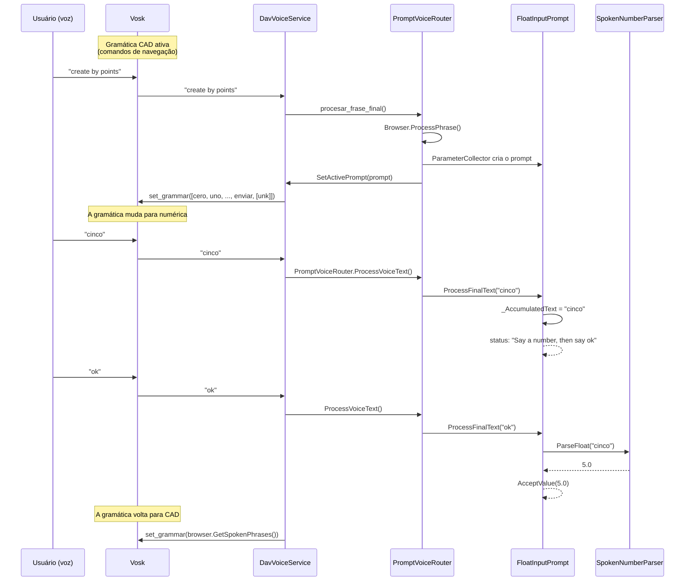
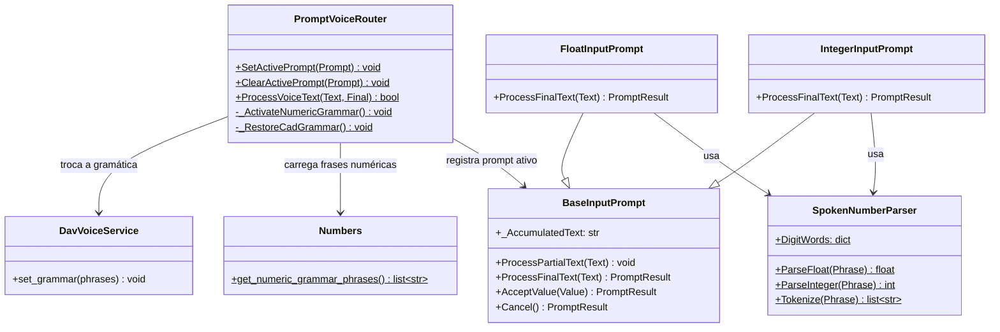

# Dicionário Numbers — Entrada numérica por voz

> Implementação do reconhecimento de números por voz para prompts paramétricos.

---

## Resumo

O sistema permite que o Vosk reconheça números falados (0-9, decimais, cifras compostas) quando o FreeCAD pede um valor numérico ao usuário. Foram implementados:

1. **Dicionário `Dav/dic/Numbers/`** — palavras numéricas em espanhol, inglês e português
2. **Gramática dinâmica** — a gramática do Vosk muda automaticamente ao abrir/fechar um prompt numérico
3. **Acúmulo de texto** — permite dizer um número e depois "ok" em frases separadas
4. **Correção do wrapper** — `create_by_points_with_objects` agora repassa os parâmetros

---

## Diagrama de fluxo



---

## Dicionário Numbers

### Estrutura de arquivos

```
Dav/dic/Numbers/
├── __init__.py        # Pacote vazio
├── Numbers.py         # Sentinelas + get_numeric_grammar_phrases()
├── TraduceToEs.py     # Palavras em espanhol
├── TraduceToEn.py     # Palavras em inglês
├── TraduceToPt.py     # Palavras em português
└── ayuda.py           # Texto de ajuda
```

### Sentinelas (`Numbers.py`)

Funções no-op que representam dígitos e separadores:

| Sentinelas | Valor |
|-----------|-------|
| `Zero`, `One`, ..., `Nine` | Dígitos 0-9 |
| `DecimalPoint`, `DecimalComma` | Separadores decimais |
| `CompoundNumber` | Qualquer palavra numérica de 10 em diante (10-19, dezenas 20-90, contrações espanholas 21-29) e o conector "y"/"e". Um único sentinel para todas: a identidade do valor nunca é usada (`get_numeric_grammar_phrases` só lê as *keys*), o valor real é calculado pelo `SpokenNumberParser` a partir da palavra. |

### Traduções — dígitos 0-9

| Espanhol | Inglês | Português | Sentinel |
|---------|--------|-----------|----------|
| cero | zero | zero | Zero |
| uno, un, una | one | um, uma | One |
| dos | two | dois, duas | Two |
| tres | three | três, tres | Three |
| cuatro | four | quatro | Four |
| cinco | five | cinco | Five |
| seis | six | seis | Six |
| siete | seven | sete | Seven |
| ocho | eight | oito | Eight |
| nueve | nine | nove | Nine |
| punto, decimal | point, decimal | ponto, decimal | DecimalPoint |
| coma | comma | vírgula, virgula | DecimalComma |

### Traduções — números compostos 10-99

Faixa suportada: **0-99**. Números de 100 em diante não estão implementados:
a palavra ("cien", "cincuenta", "hundred"...) não está em `DigitWords` nem na
gramática, então o `SpokenNumberParser` a ignora em silêncio em vez de
falhar — por exemplo "seiscientos cincuenta" dá **50**, não um erro (o
tokenizer descarta "seiscientos" por não reconhecê-lo e só faz o parse de
"cincuenta"). Estender para centenas/milhares exigiria o mesmo mecanismo de
`TensWords`/`_MergeTensAndUnits` para mais um nível.

| Espanhol | Inglês | Português |
|---------|--------|-----------|
| diez..diecinueve | ten..nineteen | dez..dezenove (dezenove também admite catorze/quatorze) |
| veinte, treinta, ..., noventa | twenty, thirty, ..., ninety | vinte, trinta, ..., noventa |
| veintiuno..veintinueve (contração de uma única palavra) | *(diz-se "twenty one", duas palavras)* | *(diz-se "vinte e um", duas palavras)* |
| conector "y" (treinta **y** dos) | *(sem conector: "twenty two")* | conector "e" (vinte **e** um) |

`SpokenNumberParser._MergeTensAndUnits` combina "dezena [conector] unidade" em
um único valor antes do parse (`InputPrompts/SpokenNumberParser.py`). O
conector é opcional: se o Vosk o engolir, "treinta dos" também dá 32. O
ditado dígito por dígito ("uno" "uno" → 11) é mantido como alternativa:
uma palavra de um único dígito sem dezena antes não é combinada, é
concatenada como antes.

### `get_numeric_grammar_phrases(language: str = "es")`

Constrói a lista de frases para a gramática do Vosk durante a entrada numérica,
**somente para o idioma indicado** — antes carregava os três idiomas ao mesmo tempo, o
que fazia o Vosk reconhecer dígitos em inglês ou português mesmo que o app
estivesse configurado em espanhol (ou qualquer combinação cruzada). O
chamador (`NumericGrammarSwitcher`) passa `core.settings.settings.language`,
o idioma efetivamente configurado.

1. Carrega apenas o `TraduceTo{Es,En,Pt}.py` correspondente a `language` via `importlib`
2. Adiciona as palavras de confirmação desse idioma, lidas de
   `NavCommands/TraduceTo*.py` (mesma origem usada pelo resto do app),
   com um respaldo fixo por idioma se o dicionário não carregar
3. Adiciona as palavras de cancelamento desse idioma, com o mesmo respaldo
4. Adiciona `[unk]` (curinga do Vosk para ruído)

Um idioma desconhecido cai para espanhol (`"es"`) por padrão.

---

## Gramática dinâmica

### Problema

Quando um `IntegerInputPrompt` ou `FloatInputPrompt` está ativo, a gramática do Vosk contém apenas comandos de navegação. Palavras como "cinco" não estão na gramática, então o Vosk as descarta ou as substitui por palavras parecidas ("opciones").

### Solução

O `PromptVoiceRouter` detecta prompts numéricos por polimorfismo
(`prompt.RequiresNumericGrammar()`, ver `NumericInputPrompt`) e delega a
troca de gramática ao `NumericGrammarSwitcher`:

```
SetActivePrompt(prompt)
  → _RequiresNumericGrammar(prompt) = True
  → NumericGrammarSwitcher.ActivateNumericGrammar()
  → DavVoiceService.set_grammar(get_numeric_grammar_phrases(settings.language))

ClearActivePrompt(prompt)
  → was_numeric = True
  → NumericGrammarSwitcher.RestoreCadGrammar()
  → BrowserVoiceAdapter.RestoreGrammar() (adaptador ativo)
  → DavVoiceService.set_grammar(browser.GetSpokenPhrases())
```

### Import path

`Dav/dic/` não está em `sys.path` por padrão. A solução adiciona o caminho dinamicamente:

```python
dic_root = str(Path(__file__).resolve().parent.parent)
if dic_root not in sys.path:
    sys.path.insert(0, dic_root)
```

---

## Acúmulo de texto (correção do Bug 2)

### Problema

Quando o usuário dizia "cinco" (frase final) e depois "ok" (frase final), o prompt substituía o texto. O parser via apenas "ok" (sem número) e não confirmava.

### Solução

`FloatInputPrompt` e `IntegerInputPrompt` acumulam texto em `_AccumulatedText`:

- **Número sem confirmação** → é acumulado: `"cinco"` → `"cinco"`
- **Confirmação com número acumulado** → faz-se o parse do acumulado e ele é limpo
- **Confirmação sem número** → "No value to confirm. Say a number first."
- **Cancelamento** → o acumulado é limpo e o prompt é fechado

```python
def ProcessFinalText(self, Text):
    tokens = SpokenNumberParser.Tokenize(Text)

    if self._HasCancellation(tokens):
        self._AccumulatedText = ""
        return self.Cancel()

    if self._HasConfirmation(tokens):
        if not self._AccumulatedText:
            self.SetStatus("No value to confirm.")
            return self.GetResult()
        parse_text = self._AccumulatedText
        self._AccumulatedText = ""
        value = SpokenNumberParser.ParseFloat(parse_text)
        return self.AcceptValue(value)

    self._AccumulatedText = (
        (self._AccumulatedText + " " + Text).strip()
        if self._AccumulatedText else Text
    )
    return self.GetResult()
```

---

## Correção do wrapper (line.py)

### Problema

`create_by_points_with_objects()` não declarava parâmetros, então o `ParameterCollector` não pedia nada e chamava `create_by_points()` sem argumentos.

### Solução

O wrapper agora assina os mesmos parâmetros que a função original:

```python
# Antes (bug)
def create_by_points_with_objects():
    create_by_points()  # ← falha: missing 4 args

# Depois (fix)
def create_by_points_with_objects(x1: float, y1: float, x2: float, y2: float, label: str = "Segment"):
    create_by_points(x1=x1, y1=y1, x2=x2, y2=y2, label=label)
```

---

## Diagrama de classes



---

## Arquivos modificados

| Arquivo | Mudança |
|---------|--------|
| `Dav/dic/Numbers/*` | **Novo** — dicionário completo (6 arquivos) |
| `InputPrompts/PromptVoiceRouter.py` | Troca de gramática numérica |
| `InputPrompts/BaseInputPrompt.py` | `_AccumulatedText` |
| `InputPrompts/FloatInputPrompt.py` | Acúmulo de texto |
| `InputPrompts/IntegerInputPrompt.py` | Acúmulo de texto |
| `integration/browser_voice_adapter.py` | `_ActiveAdapter` global |
| `Workbench/Sketcher/Geometry/line/line.py` | Wrapper com parâmetros |
