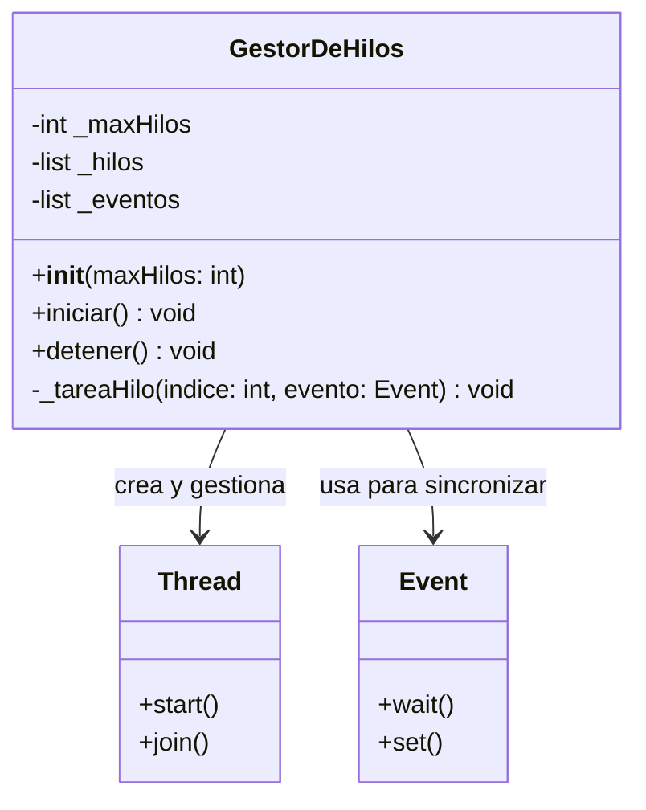
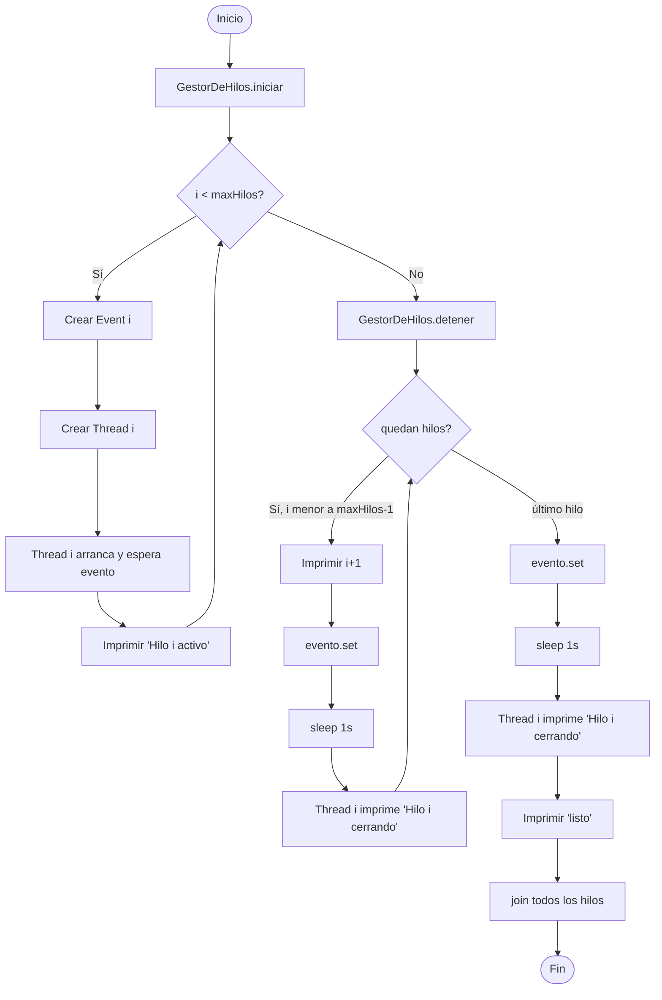

# GestorDeHilos — Documentación

**Autores:** Bianca Micaela Tournour, Maitén Blanc, Julian Agustín Olivera  
**Grupo 4 — Práctica Educativa Territorial FCyT-UADER, 2026**

---

## Descripción

`GestorDeHilos` gestiona el ciclo de vida de hasta N hilos de trabajo dentro del DAVCore.  
Levanta todos los hilos de forma secuencial (uno tras otro) y luego los cierra uno a uno
con un segundo de separación, mientras el hilo principal imprime la cuenta del 1 al 9
seguida de "listo".

---

## Diagrama de clases

---

## Diagrama de flujo

