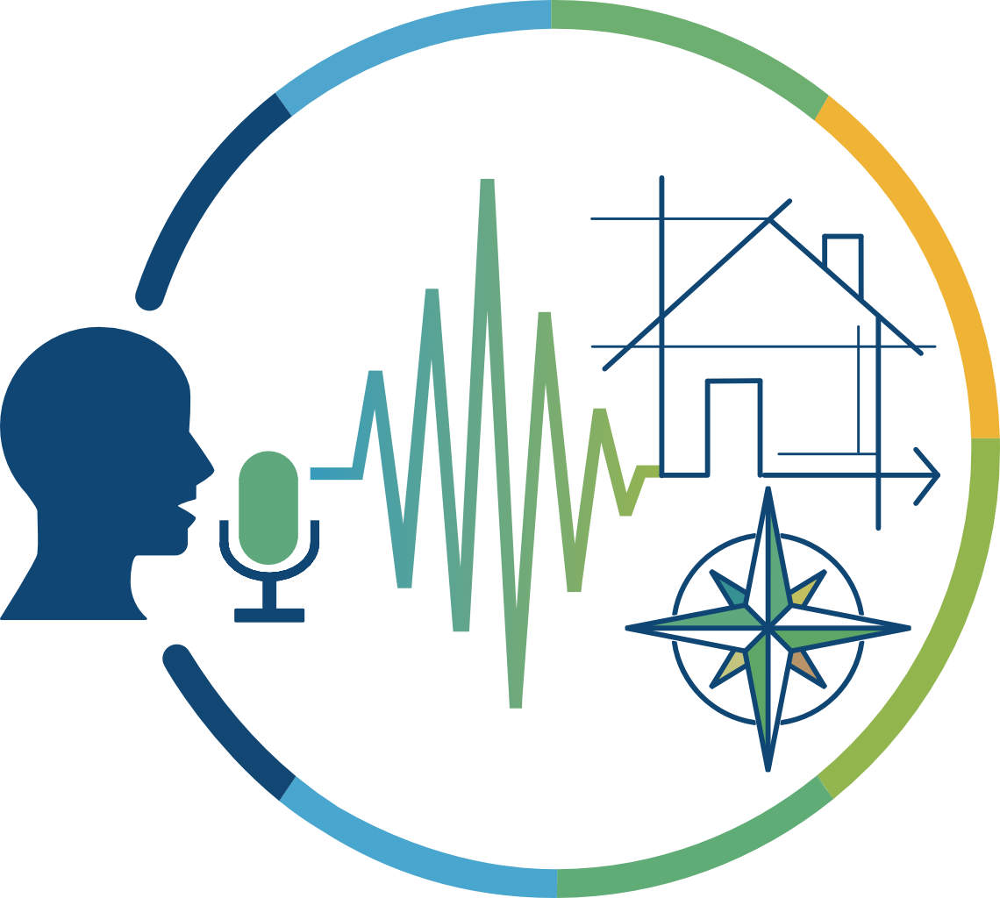

[ English](README.md) | [ Español](README.es.md) | [ Português](README.pt.md)

# DAV — Desenho Assistido pela Voz

  

**DAV** é um projeto acadêmico desenvolvido no contexto de uma **Prática Educativa Territorial (PET)** da [**Universidad Autónoma de Entre Ríos (UADER)**](https://uader.edu.ar/). O projeto é voltado para integração de comandos de voz no software de modelagem [**FreeCAD**](https://www.freecad.org/index.php).

O objetivo do projeto é permitir que pessoas com dificuldades motoras nos braços, mas sem distúrbios de fala, possam criar e modificar modelos, desenhos e peças 3D usando comandos de voz. Dessa forma, busca-se reduzir a dependência exclusiva do teclado e do mouse, complementando a interação tradicional dentro do ambiente CAD e tornando a tecnologia mais acessível pra galera.

O DAV funciona como uma camada de assistência sobre o FreeCAD, integrando-se através de Python e aproveitando sua arquitetura nativa. O reconhecimento de voz é processado localmente utilizando [**Vosk**](https://alphacephei.com/vosk/), um motor ASR (*Automatic Speech Recognition*) open source.

---

## Estado do projeto

O DAV está atualmente em uma fase inicial de **MVP** (*Minimum Viable Product*), com foco em modelagem 2D/3D. Portanto, nem todas as ferramentas (*Workbenches*) do FreeCAD estão disponíveis ainda. Mesmo assim, ele já conta com os recursos essenciais para que um profissional consiga utilizá-lo no dia a dia sem perrengue.

## Principais Características

- **Acessibilidade:** Criação e modificação de geometria básica através de comandos de voz.
- **Integração fluida:** Comunicação direta com o ambiente do FreeCAD.
- **Feedback em tempo real:** Retorno visual e textual na interface.
- **Uso complementar:** Compatibilidade simultânea com teclado e mouse.

## Tecnologias Utilizadas

- **Linguagem principal:** Python
- **Ambiente CAD:** API do FreeCAD
- **Reconhecimento de Voz:** Vosk
- **Captura de Áudio:** SoundDevice
- **Interface Gráfica:** PySide6
- **Controle de Versão:** Git

## Requisitos mínimos do sistema

- **Sistema operacional:** Windows 10 (64-bit) ou superior; ou qualquer distribuição Linux de 64 bits (por exemplo: Ubuntu 20.04)
- **Processador:** CPU x86 de 64 bits (Intel Core ou AMD Athlon/Ryzen).
- **Memória RAM:** 8 GB ou mais
- **Armazenamento:** 2,5 GB de espaço livre em disco.

## Manual do Usuário

- [Manual do Usuário (PDF)](Manual_do_Usuario.pdf)

## Licença

Este projeto é distribuído sob a licença **GNU GPL v3**.

Além disso, utiliza tecnologias e bibliotecas de terceiros sob diferentes licenças open source, incluindo componentes relacionados ao FreeCAD, Qt/PySide e Vosk.
